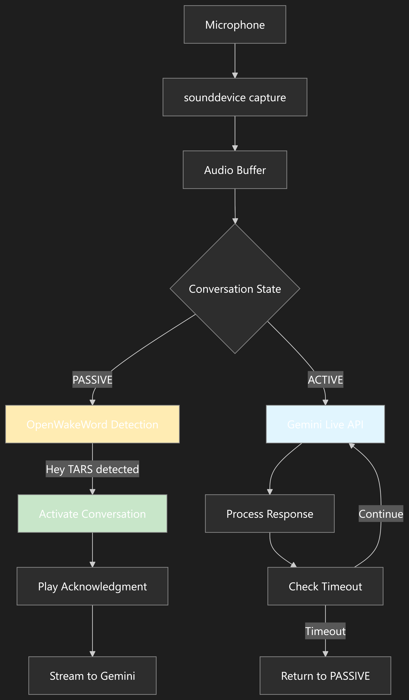

# GemiTARS: A TARS-themed Conversational AI assistant

A conversational AI voice assistant inspired by TARS from Interstellar, featuring continuous conversations powered by Gemini Live API. Uses a distributed architecture with a compact ESP32 "head" for I/O and a server "brain" for AI processing, enabling rich voice and vision interactions with function calling capabilities.

This file provides overview and high level goals/features and architecture of the project.

- **To see the current state/progress of the project** (what is already implemented, what needs to be implemented etc.), **see** [`docs/current_state.md`](docs/current_state.md).
- To see full documentation about Gemini Live API, see [`docs/gemini/`](docs/gemini/).
- The ESP32 firmware is in [`esp32_firmware/`](esp32_firmware/).

## Core Features Overview

- **Hotword Detection**: Listening for a wake word ("Hey, TARS!").
- **Continuous Conversation**: After activation, the assistant actively listens for a set duration (connection to Gemini LIVE API is established), allowing for natural, back-and-forth conversation without re-triggering the hotword. When a timeout is reached, the assistant will return to passive hotword listening.
- **Direct Audio-to-LLM**: Audio is streamed directly to the Gemini Live API, skipping an intermediate transcription step to minimize latency and improve conversational flow.
- **Multimodal Input**: (later feature) Capable of capturing and sending on-demand images to the LLM alongside voice commands for visual context.
- **Custom Voice Output**: Generates a high-fidelity TARS-like voice using ElevenLabs' text-to-speech (TTS) streaming service.
- **Distributed Architecture**: A compact, low-profile ESP32 unit handles all sensor I/O, while a powerful server manages all the heavy lifting (AI processing, audio processing, logic).
- **Function Calling:** The assistant will be able to process complex conversational sentences and execute functions (e.g., control smart home devices, perform internet searches...).

## Gemini Live API

Extremely fast and low-latency LLM API that:

- Takes in not only text text, but also images, audio, or combination of these.
- Streams back responses in real-time, either in text, or audio.
- Has a built-in VAD (voice activity detection) to automatically wait for a user's speech before responding etc.
- Has a Live mode, where it itself manages the whole session - it takes in the user's talking (input audio) directly, and decides when and how to respond, whether to be interrupted etc. - no processing on the side of our server.

## System Architecture

The system uses a distributed architecture split into two main components communicating over WiFi, designed to keep the user-facing device compact while leveraging powerful server-side processing.

- **Remote Unit (The "Head"):** A small, ESP32-based device that handles all physical input/output. Its sole responsibilities are:
  - Capturing microphone audio and streaming it to the processing hub.
  - Capturing on-demand camera images/video and sending/streaming them.
  - Receiving the final audio stream and playing it through a connected speaker.
- **Processing Hub (The "Brain"):** A server that runs the core logic. It is responsible for:
  - Receiving the raw audio (or image/video) streams from the ESP32.
  - Hotword detection etc.
  - Communicating with a cloud-based Large Language Model (LLM) for conversation and logic.
  - Managing the entire interaction flow and state.
  - Sending the final, synthesized speech back to the ESP32 for playback.

This distributed approach was chosen to fulfill the goal of a minimal physical footprint for the user-facing device, with the ESP32 acting as a lightweight "sensor pod" that offloads all intensive computation to the more powerful server. The direct LLM audio processing (via Gemini Live) reduces latency by eliminating the traditional Speech-to-Text transcription step, while high-fidelity TTS (ElevenLabs) provides authentic TARS voice synthesis rather than attempting complex real-time voice transformation.

## The logic flow

The GemiTARS system operates through several distinct phases, seamlessly transitioning between passive listening and active conversation modes (details of this implementation plan might change):

Tl;Dr:

- ESP32 mic streams audio to server continuously, at all times
- server continuously runs hotword detection
- if hotword is detected, Gemini Live API session is established and server sends acknowledgment tone to ESP32 ("mhm"...)
- the conversation now continues through the Gemini Live API, with the ESP32 still streaming audio to the server and the server streaming audio (the LLM response audio) to the ESP32.
- When gemini live api returns text -> send it to elevenlabs -> stream back it's audio chunks directly to the ESP32
- If no sound is detected / no reply is coming, time out and return to passive listening mode

note:
A user cannot interrupt TARS while he is thinking (PROCESSING) or speaking (SPEAKING). If the user says "Stop" or "Wait, I meant something else," the microphone is effectively off. This is a current decision and might be changed in the future.

### 1. Passive Listening State

- The **Processing Hub** (server) continuously monitors audio streams from the ESP32 for the wake word "Hey, TARS!"
- Uses **Hotword detection** running locally on the server for low-latency, offline wake word recognition
- The ESP32 streams raw audio data over WiFi to the server at all times, but the server only processes it for hotword detection (NOTE: This is still an internal discussion - whether to stream audio at all times, hampering battery life and privacy, or try to put a hotword detection model directly on the ESP32 itself OR have the ESP32 only start streaming audio to the server after sound is detected (would require buffered mic))
- System remains in low-power conversation mode, with minimal processing overhead

### 2. Wake Word Activation

- When "Hey, TARS!" is detected, the system immediately transitions to **Active Conversation Mode**
- A **Gemini Live API session** is established for real-time, bidirectional audio streaming
- The server sends an acknowledgment tone or brief response to the ESP32 to indicate successful activation (e.g. "yeah", "mhm", "listening", "Yes sir"...)
- A conversation timeout timer begins (configurable duration, typically 30-60 seconds)

This is roughly how the hotword detection flow is planned currently (might change):

### 3. Active Conversation Mode

- **Direct Audio Streaming**: Raw audio from the ESP32 microphone is streamed directly to the Gemini Live API
  - No local speech-to-text transcription occurs, reducing latency
  - Gemini Live handles real-time audio processing and understanding
- **Multimodal Input**: User can request visual context by saying phrases like "look at this" or "what do you see?"
  - ESP32 captures a still image using the onboard camera (not sure how this will be handled yet)
  - Image is sent to the server and included in the next Gemini API request alongside audio
- **Continuous Listening**: The system maintains the connection and actively listens for follow-up questions or commands
- **Conversation Timer**: Resets with each user interaction to maintain natural conversation flow

### 4. Response Generation and Playback

- **LLM Processing**: Gemini Live processes the audio (and optional image) input and generates a text response
- **Function Calling**: If the response includes function calls (smart home control, web searches, etc.), these are executed on the server
- **Voice Synthesis**: The text response is sent to **ElevenLabs TTS API** for conversion to TARS-like voice
- **Audio Streaming**: The synthesized audio is streamed back to the ESP32 in real-time
- **Playback**: ESP32 plays the audio through the connected I²S speaker/amplifier

### 5. Conversation Continuation or Timeout

- **Active Listening Continues**: After each response, the system continues listening for follow-up input
- **Timer Management**: Each user interaction resets the conversation timeout
- **Natural Conversation**: Users can interrupt, ask follow-up questions, or change topics without re-triggering the wake word
- **Timeout Handling**: If no user input is detected within the timeout period, the system gracefully closes the Gemini Live session and reverts back to passive listening mode

### 6. Return to Passive State

- **Session Cleanup**: The Gemini Live API connection is terminated
- **State Reset**: System returns to passive hotword detection mode
- **Resource Management**: Server reduces processing load back to minimal hotword monitoring
- **Ready for Next Activation**: ESP32 continues streaming audio for the next "Hey, TARS!" detection

### Error Handling and Edge Cases

- **Network Interruptions**: If WiFi connection is lost, ESP32 attempts reconnection while buffering audio locally
- **Audio Quality Issues**: Automatic gain control and noise reduction are applied to incoming audio streams
- **Concurrent Requests**: System queues multiple rapid inputs to prevent audio stream conflicts

## Hardware

1. **Server (core processor)**: Any local or hosted server (computer, VPS, Raspberry Pi...)
2. **Sensor Hub**: An ESP32 development board.
3. **Microphone**: A I²S microphone INMP441 (for clear audio capture and from far away.)
4. **Camera**: A OV2640 2MP camera for capturing images, so Tars can 'see'.
5. **Speaker**: A MAX98357A DAC I²S amplifier connected to a 3W 4Ω 40mm speaker.
6. **Power**: Separate, stable power supplies for the ESP32.
7. **Casing**: (Optional) 3D-printed (TARS) case to house the ESP32, camera, mic, and speaker.

---

**Below are less important details and setup info.**

## ESP32 Firmware Setup

- **Libraries**:
  - `ArduinoWebsockets`: For real-time, bidirectional communication.
  - Libraries for I²S audio handling (e.g., `I2S.h`).
  - ESP32 Camera libraries.

1. Set up your development environment using **PlatformIO** in VSCode (recommended).
2. Navigate to the `esp32_firmware/` directory.
3. Modify `src/config.h` to include your WiFi SSID and password, and the static IP address of your Raspberry Pi.
4. Connect the I²S microphone and speaker amplifier to the correct GPIO pins as defined in the firmware.
5. Compile and upload the firmware to your ESP32-CAM board. Use a USB-to-TTL serial programmer if your board doesn't have a built-in USB port.

6. In the ElevenLabs dashboard, create your custom "TARS" voice and place its Voice ID in the `.env` file.

## Coding conventions

Just make sure the code is clean, tidy, and understandable. The project is big, so we try to minimize complexity.

## Future Work \& Roadmap

- [ ] **Display**: A display for the TARS robot.
- [ ] **Improve Noise Cancellation**: Implement software-based noise reduction on the audio stream received from the ESP32.
- [ ] **Dynamic Configuration of system settings**: Allow system settings (e.g., conversation timeout) to be changed via voice commands.
- [ ] **Dynamic Configuration of preferences**: Allow to save preferences, possibly in a system of memories (humor setting, personality etc.).
- [ ] **Handle interruptions**: Interruptions handling (includes echo cancellation (since the mic is listening while the speaker is outputting audio) etc.)

Potential TARS voice from existing elevenlabs voice: https://elevenlabs.io/app/voice-library?voiceId=qIT7IrVUa21IEiKE1lug
