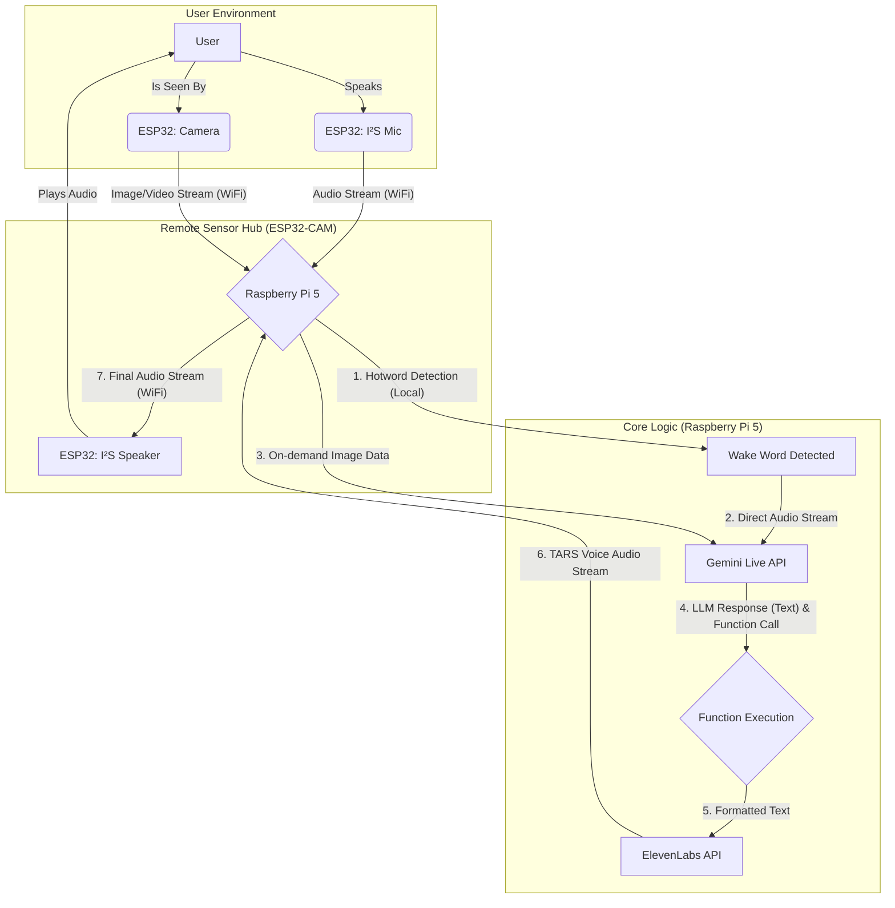

# GemiTARS: A Conversational AI

## NOTE: THIS IS A CONCEPT OF THE ARCHITECTURE. THE IMPLEMENTATION AND FUNCTIONALITY MIGHT BE DIFFERENT OR CHANGE COMPLETELY.

## NOTE2: ARDUINO IS CURRENTLY USED VIA A WIRED CABLE, INSTEAD OF ESP32 WIFI, AND WE WILL START WITH MIC ONLY.

An advanced, conversational AI assistant inspired by TARS from _Interstellar_. This project uses a distributed architecture with a Raspberry Pi 5 for core processing and an ESP32-CAM as a remote sensor hub, enabling real-time, multimodal interactions with a powerful Large Language Model[^1].

## Table of Contents

- [Core Features](#core-features)
- [System Architecture](#system-architecture)
- [Hardware Requirements](#hardware-requirements)
- [Software \& API Dependencies](#software--api-dependencies)
- [Setup and Installation](#setup-and-installation)
  - [1. ESP32-CAM Firmware Setup](#1-esp32-cam-firmware-setup)
  - [2. Raspberry Pi 5 Backend Setup](#2-raspberry-pi-5-backend-setup)
  - [3. API Configuration](#3-api-configuration)
- [How to Run](#how-to-run)
- [Project Structure](#project-structure)
- [Architectural Choices \& Rationale](#architectural-choices--rationale)
- [Future Work \& Roadmap](#future-work--roadmap)

## Core Features

- **Hotword Detection**: Low-power, offline listening for a wake word ("Hey, TARS!").
- **Continuous Conversation**: After activation, the assistant actively listens for a set duration, allowing for natural, back-and-forth conversation without re-triggering the hotword.
- **Direct Audio-to-LLM**: Audio is streamed directly to the Gemini Live API, skipping an intermediate transcription step to minimize latency and improve conversational flow.
- **Multimodal Input**: Capable of capturing and sending on-demand images to the LLM alongside voice commands for visual context.
- **Real-time Video Streaming**: Can be switched to a continuous video streaming mode (5-10 FPS) for tasks like object tracking.
- **Function Calling**: The LLM can execute predefined Python functions on the Raspberry Pi to interact with other APIs or local devices.
- **Custom Voice Output**: Generates a high-fidelity TARS-like voice using ElevenLabs' text-to-speech (TTS) streaming service.
- **Distributed Architecture**: A compact, low-profile ESP32-CAM unit handles all sensor I/O, while a powerful Raspberry Pi 5 manages all the heavy lifting (AI processing, logic).

## System Architecture

The system is split into two main components that communicate over WiFi. This allows the user-facing device to be small and sleek.



## Hardware Requirements

1. **Core Processor**: Raspberry Pi 5 (4GB or 8GB model recommended).
2. **Sensor Hub**: An ESP32-CAM development board.
   - _Note: Ensure the model has sufficient PSRAM for camera operations._
3. **Microphone**: A high-quality I²S microphone (e.g., INMP441) for clear audio capture.
4. **Speaker**: An I²S amplifier/DAC module (e.g., MAX98357A) connected to a 3W or 5W speaker.
5. **Power**: Separate, stable power supplies for the Raspberry Pi 5 (5V/5A USB-C) and the ESP32.
6. **Casing**: (Optional) 3D-printed (TARS) case to house the ESP32, camera, mic, and speaker.

## Software \& API Dependencies

#### Raspberry Pi 5 (Backend)

- **Python**: 3.11
- **Libraries**:
  - `google-generativeai`: For Gemini Live API.
  - `elevenlabs`: For TTS streaming.
  - `websockets` or `aiohttp`: For communication with the ESP32.
  - `pvporcupine`: For hotword detection.
  - `opencv-python`: For processing video streams.
  - `python-dotenv`: For managing API keys.

#### ESP32-CAM (Firmware)

- **Framework**: Arduino or PlatformIO (recommended).
- **Libraries**:
  - `ArduinoWebsockets`: For real-time, bidirectional communication.
  - Libraries for I²S audio handling (e.g., `I2S.h`).
  - ESP32 Camera Driver.

## Setup and Installation

### 1. ESP32-CAM Firmware Setup

1. Set up your development environment using **PlatformIO** in VSCode (recommended) or the Arduino IDE.
2. Navigate to the `esp32_firmware/` directory.
3. Modify `src/config.h` to include your WiFi SSID and password, and the static IP address of your Raspberry Pi.
4. Connect the I²S microphone and speaker amplifier to the correct GPIO pins as defined in the firmware.
5. Compile and upload the firmware to your ESP32-CAM board. Use a USB-to-TTL serial programmer if your board doesn't have a built-in USB port.

### 2. Raspberry Pi 5 Backend Setup

1. Clone this repository to your Raspberry Pi:

```bash
git clone https://github.com/your-username/project-tars.git
cd project-tars
```

2. Create and activate a Python virtual environment:

```bash
python3 -m venv venv
source venv/bin/activate
```

3. Install all required Python packages:

```bash
pip install -r requirements.txt
```

### 3. API Configuration

1. Create a `.env` file in the root directory of the project by copying the example:

```bash
cp .env.example .env
```

2. Open the `.env` file and fill in your API keys:

```
GEMINI_API_KEY="YOUR_GEMINI_API_KEY"
ELEVENLABS_API_KEY="YOUR_ELEVENLABS_API_KEY"
PICOVOICE_ACCESS_KEY="YOUR_PICOVOICE_ACCESS_KEY"
```

3. In the ElevenLabs dashboard, create your custom "TARS" voice and place its Voice ID in the `.env` file.

## How to Run

0. Use conda
1. Power on the ESP32-CAM. It will automatically connect to your WiFi and attempt to establish a WebSocket connection with the Raspberry Pi.
2. On the Raspberry Pi, activate the virtual environment and run the main application:

3. The backend server will start. Once the ESP32 connects, the system is live.
4. Say the hotword ("Hey, TARS!") to begin a conversation.

## Project Structure

```
project-tars/
├── rpi_backend/
│   ├── main.py             # Main application entry point
│   ├── config.py           # Loads settings and API keys
│   ├── communication.py    # Handles WebSocket server for ESP32
│   ├── hotword.py          # Hotword detection logic
│   ├── gemini_client.py    # Manages interaction with Gemini Live API
│   ├── elevenlabs_client.py# Manages TTS streaming
│   ├── function_handler.py # Defines and executes available functions
│   └── utils/
│       └── ...
├── esp32_firmware/
│   ├── platformio.ini      # PlatformIO configuration
│   └── src/
│       ├── main.cpp        # Main firmware logic for ESP32
│       └── config.h        # WiFi credentials and server IP
├── .env                    # (Private) API keys and secrets
├── .env.example            # Template for the .env file
├── requirements.txt        # Python package dependencies
└── README.md               # You are here
```

## Architectural Choices \& Rationale

- **Distributed Architecture (Pi + ESP32)**: This was chosen to fulfill the goal of a minimal physical footprint for the user-facing device. The ESP32 acts as a lightweight "sensor pod," offloading all intensive computation to the more powerful Raspberry Pi.
- **Direct LLM Audio (Gemini Live)**: Instead of a traditional `Speech-to-Text -> Text -> LLM -> Text -> Text-to-Speech` pipeline, we use `Audio -> LLM -> Text -> TTS`. This reduces a major point of latency and potential transcription errors, making the conversation feel more fluid and responsive.
- **High-Fidelity TTS (ElevenLabs)**: While real-time voice _transformation_ was considered, it adds significant complexity and potential for audio artifacts. Using a dedicated, high-quality TTS service like ElevenLabs provides a more reliable and authentic TARS voice, which is critical to the user experience.

## Future Work \& Roadmap

- [ ] **Improve Noise Cancellation**: Implement software-based noise reduction on the audio stream received from the ESP32.
- [ ] **Multi-Turn Function Calling**: Develop a more robust state management system to handle complex, multi-step tasks.
- [ ] **Local Fallback**: Implement a smaller, local LLM that can handle simple commands if the internet connection is lost.
- [ ] **Dynamic Configuration**: Allow system settings (e.g., conversation timeout) to be changed via voice commands.

<div style="text-align: center">⁂</div>

[^1]: projects.ai_assistant

---

### Project Summary: TARS-themed AI Voice Assistant

#### 1. Project Goal \& Vision

The primary goal is to create a custom, hardware-based AI "voice assistant" (a TARS from Interstellar robot), inspired by Google Home but with the specific personality, voice, and conversational style of the robot TARS from the movie _Interstellar_ and with function calling provided by the LLM. The device will be physically compact and capable of rich, continuous, and multimodal (voice and vision) conversations.

#### 2. Core User Interaction Flow

- **Hotword Activation:** The device is activated from a passive listening state using a local hotword detector.
- **Continuous Conversation:** Once activated, it enters an "active listening" mode, allowing for a natural, back-and-forth conversation without needing the hotword for each turn.
- **Silence Timeout:** The device will automatically return to its passive, hotword-listening state after a designated period of silence.
- **Function Calling:** The assistant must be able to process complex conversational sentences and execute functions (e.g., control smart home devices, perform lookups - this is a later step).

#### 3. High-Level Technical Architecture

_NOTE: THIS IS NOT VALID FOR NOW. FOR NOW, WE WILL USE ARDUINO CONNECTED VIA A CABLE, SO THE MICROPHONE/CAMERA DATA, AS WELL AS A SPEAKER, WILL NOT BE TRANSMITTED USING WIFI_

The architecture is split into two main components communicating over a local WiFi network to keep the user-facing device as small as possible.

- **Remote Unit (The "Head"):** A small, ESP32-based device that handles all physical input/output. Its sole responsibilities are:
  - Capturing microphone audio and streaming it to the processing hub.
  - Capturing on-demand camera images/video and streaming them.
  - Receiving the final audio stream and playing it through a connected speaker.
- **Processing Hub (The "Brain"):** A Raspberry Pi 5 that runs the core logic. It is responsible for:
  - Receiving the raw audio (or image/video) streams from the ESP32.
  - Communicating with a cloud-based Large Language Model (LLM) for conversation and logic.
  - Managing the entire interaction flow and state.
  - Sending the final, synthesized speech back to the ESP32 for playback.

#### 4. Key Technology \& Component Decisions

- **Audio Input Processing:** The project will **stream raw audio directly** to a cloud LLM instead of performing local transcription first.
  - **Chosen Tool:** **Gemini Live API**, selected for its ability to handle low-latency, real-time, bidirectional audio streams, which is ideal for a conversational assistant.
- **Voice Synthesis (The TARS Voice):** The chosen method is to receive text from the LLM and then synthesize it into the TARS voice. The alternative—modifying a generic voice on-the-fly—was deemed too complex and likely to produce a lower-quality result.
  - **Chosen Tool:** **ElevenLabs API**, selected for its high-fidelity voice cloning and streaming capabilities, which will be used to create an authentic-sounding TARS voice.
- **Visual Input (Camera):** The system must support two camera use cases.
  - **Single Image Capture:** On demand, the ESP32 will capture a still image and send it to the Raspberry Pi. This visual context will be sent to the LLM along with the user's speech to enable multimodal understanding.
  - **Continuous Video Stream:** The system will support a continuous, low-frame-rate (5-25 FPS) video stream for tasks like object tracking or robot navigation.

#### 5. Other

- Do not use thinking in gemini models for better latency.

### NOTE: WE WILL START WITH THE MIC ONLY IMPLEMENTATION, ARDUINO + RPI 5
