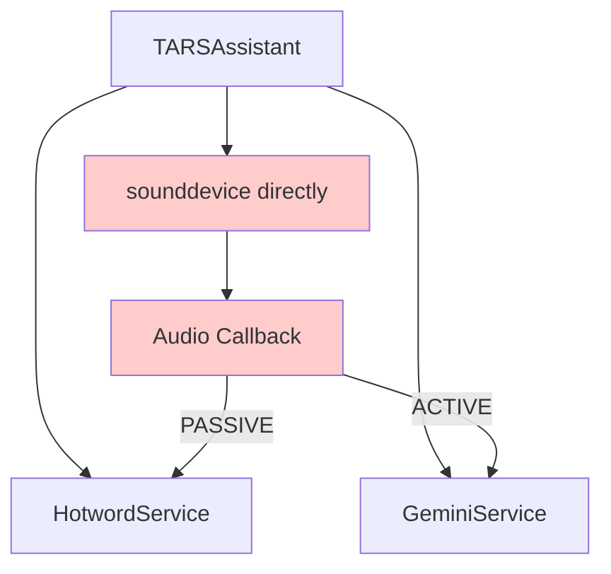
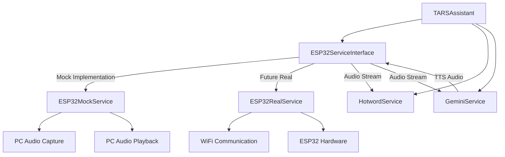
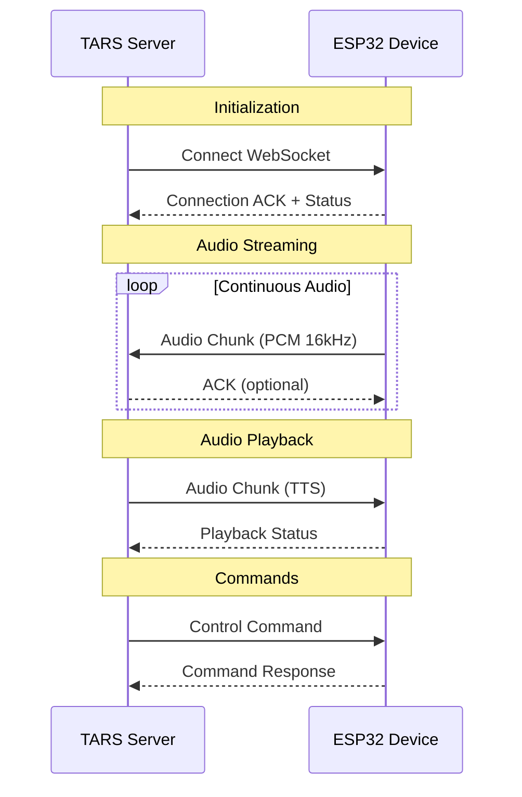

# ESP32 Mock Service Implementation Plan

## Overview

This document outlines the implementation plan for creating an ESP32 mock service that will simulate ESP32 input/output capabilities while running on the PC. This approach provides clean separation of concerns and establishes the interface contract for future ESP32 hardware integration.

## Goals & Benefits

### Primary Goals
- **Interface Abstraction**: Create a clean interface that both mock and real ESP32 services will implement
- **Hardware Simulation**: Simulate ESP32 audio I/O capabilities using PC hardware
- **Future-Proof Design**: Establish communication protocols and data structures for real ESP32 integration
- **Development Efficiency**: Enable full-stack development without physical ESP32 hardware

### Key Benefits
- ✅ **Clean Architecture**: Separates hardware concerns from business logic
- ✅ **Easy Testing**: Simplified testing and development workflow
- ✅ **Smooth Transition**: Seamless migration to real ESP32 hardware
- ✅ **Protocol Design**: Forces proper communication protocol design early
- ✅ **Resource Management**: Better control over audio resources and state

## Current Architecture Analysis

### Current State (Tightly Coupled)


### Target Architecture (Abstracted)


## Interface Design

### Core Interface Contract

```python
# src/services/esp32_interface.py
from abc import ABC, abstractmethod
from typing import Callable, Optional, Dict, Any
import asyncio

class ESP32ServiceInterface(ABC):
    """
    Abstract interface for ESP32 services (both mock and real implementations).
    
    This interface defines the contract that all ESP32 service implementations
    must follow, ensuring seamless switching between mock and real hardware.
    """
    
    @abstractmethod
    async def initialize(self) -> None:
        """Initialize the ESP32 service and establish connections."""
        pass
    
    @abstractmethod
    async def shutdown(self) -> None:
        """Clean shutdown of the ESP32 service."""
        pass
    
    # Audio Input Methods
    @abstractmethod
    async def start_audio_streaming(self) -> None:
        """Start continuous audio streaming from microphone."""
        pass
    
    @abstractmethod
    async def stop_audio_streaming(self) -> None:
        """Stop audio streaming."""
        pass
    
    @abstractmethod
    def set_audio_callback(self, callback: Callable[[bytes], None]) -> None:
        """
        Set callback function for incoming audio data.
        
        Args:
            callback: Function that receives audio bytes (16kHz, 16-bit PCM)
        """
        pass
    
    # Audio Output Methods
    @abstractmethod
    async def play_audio_chunk(self, audio_data: bytes) -> None:
        """
        Play audio chunk through speaker.
        
        Args:
            audio_data: Audio bytes to play (format matches input format)
        """
        pass
    
    @abstractmethod
    async def stop_audio_playback(self) -> None:
        """Stop current audio playback and clear audio queue."""
        pass
    
    # Camera Methods (Future Implementation)
    @abstractmethod
    async def capture_image(self) -> Optional[bytes]:
        """
        Capture image from camera.
        
        Returns:
            Image bytes in JPEG format, or None if unavailable
        """
        pass
    
    # Status and Control
    @abstractmethod
    def get_status(self) -> Dict[str, Any]:
        """
        Get current device status.
        
        Returns:
            Dictionary containing device status information
        """
        pass
    
    @abstractmethod
    def is_connected(self) -> bool:
        """Check if the ESP32 service is connected and operational."""
        pass


class AudioStreamConfig:
    """Configuration for audio streaming."""
    
    def __init__(self):
        self.sample_rate: int = 16000
        self.channels: int = 1
        self.dtype: str = 'int16'
        self.block_size: int = 1600
        self.mime_type: str = "audio/pcm;rate=16000"


class ESP32Status:
    """Standard status structure for ESP32 services."""
    
    def __init__(self):
        self.is_connected: bool = False
        self.audio_streaming: bool = False
        self.audio_playing: bool = False
        self.last_activity: Optional[float] = None
        self.error_count: int = 0
        self.last_error: Optional[str] = None
```

### Mock Implementation

```python
# src/services/esp32_mock_service.py
import asyncio
import numpy as np
import sounddevice as sd
import threading
import time
from typing import Callable, Optional, Dict, Any
from queue import Queue

from .esp32_interface import ESP32ServiceInterface, AudioStreamConfig, ESP32Status
from config import Config


class ESP32MockService(ESP32ServiceInterface):
    """
    Mock implementation of ESP32 service using PC audio hardware.
    
    This service simulates ESP32 behavior by:
    - Using PC microphone for audio input
    - Using PC speakers for audio output  
    - Providing the same interface as real ESP32 service
    - Simulating network latency and behavior characteristics
    """
    
    def __init__(self):
        # Core components
        self.audio_config = AudioStreamConfig()
        self.status = ESP32Status()
        
        # Audio streaming
        self.audio_callback: Optional[Callable[[bytes], None]] = None
        self.input_stream: Optional[sd.InputStream] = None
        self.output_stream: Optional[sd.OutputStream] = None
        
        # Audio output queue and management
        self.audio_output_queue = Queue()
        self.audio_output_task: Optional[asyncio.Task] = None
        self.is_playing_audio = False
        
        # Threading and synchronization
        self.loop: Optional[asyncio.AbstractEventLoop] = None
        self._lock = threading.Lock()
        
        # Statistics and monitoring
        self.stats = {
            'audio_chunks_received': 0,
            'audio_chunks_played': 0,
            'total_audio_bytes_in': 0,
            'total_audio_bytes_out': 0,
            'connection_time': None
        }
    
    async def initialize(self) -> None:
        """Initialize the mock ESP32 service."""
        print("🔌 ESP32 Mock: Initializing...")
        
        # Store event loop for thread-safe operations
        self.loop = asyncio.get_running_loop()
        
        # Simulate connection time
        await asyncio.sleep(0.1)  # Mock network connection delay
        
        # Initialize audio output processing task
        self.audio_output_task = asyncio.create_task(self._audio_output_worker())
        
        # Update status
        with self._lock:
            self.status.is_connected = True
            self.status.last_activity = time.time()
            self.stats['connection_time'] = time.time()
        
        print("✅ ESP32 Mock: Initialized successfully")
    
    async def shutdown(self) -> None:
        """Clean shutdown of mock service."""
        print("🔄 ESP32 Mock: Shutting down...")
        
        # Stop audio streaming
        await self.stop_audio_streaming()
        await self.stop_audio_playback()
        
        # Cancel output worker task
        if self.audio_output_task and not self.audio_output_task.done():
            self.audio_output_task.cancel()
            try:
                await self.audio_output_task
            except asyncio.CancelledError:
                pass
        
        # Update status
        with self._lock:
            self.status.is_connected = False
            self.status.audio_streaming = False
            self.status.audio_playing = False
        
        print("✅ ESP32 Mock: Shutdown complete")
    
    async def start_audio_streaming(self) -> None:
        """Start audio streaming from PC microphone."""
        if self.status.audio_streaming:
            print("⚠️ ESP32 Mock: Audio streaming already active")
            return
        
        def audio_callback(indata, frames, time, status):
            if status:
                print(f"⚠️ ESP32 Mock: Audio input status: {status}")
                
            # Convert audio data to bytes
            audio_bytes = indata.tobytes()
            
            # Update statistics
            with self._lock:
                self.stats['audio_chunks_received'] += 1
                self.stats['total_audio_bytes_in'] += len(audio_bytes)
                self.status.last_activity = time.time()
            
            # Call the registered callback (thread-safe)
            if self.audio_callback and self.loop:
                self.loop.call_soon_threadsafe(
                    self.audio_callback, audio_bytes
                )
        
        try:
            # Create and start input stream
            self.input_stream = sd.InputStream(
                samplerate=self.audio_config.sample_rate,
                blocksize=self.audio_config.block_size,
                dtype=self.audio_config.dtype,
                channels=self.audio_config.channels,
                callback=audio_callback,
            )
            
            self.input_stream.start()
            
            # Update status
            with self._lock:
                self.status.audio_streaming = True
                self.status.last_activity = time.time()
            
            print("🎤 ESP32 Mock: Audio streaming started")
            
        except Exception as e:
            error_msg = f"Failed to start audio streaming: {e}"
            print(f"❌ ESP32 Mock: {error_msg}")
            
            with self._lock:
                self.status.error_count += 1
                self.status.last_error = error_msg
            
            raise
    
    async def stop_audio_streaming(self) -> None:
        """Stop audio streaming."""
        if not self.status.audio_streaming:
            return
        
        try:
            if self.input_stream:
                self.input_stream.stop()
                self.input_stream.close()
                self.input_stream = None
            
            # Update status
            with self._lock:
                self.status.audio_streaming = False
                self.status.last_activity = time.time()
            
            print("🔇 ESP32 Mock: Audio streaming stopped")
            
        except Exception as e:
            error_msg = f"Error stopping audio streaming: {e}"
            print(f"⚠️ ESP32 Mock: {error_msg}")
            
            with self._lock:
                self.status.error_count += 1
                self.status.last_error = error_msg
    
    def set_audio_callback(self, callback: Callable[[bytes], None]) -> None:
        """Set callback for incoming audio data."""
        with self._lock:
            self.audio_callback = callback
        print("🔗 ESP32 Mock: Audio callback registered")
    
    async def play_audio_chunk(self, audio_data: bytes) -> None:
        """Queue audio chunk for playback."""
        if not self.status.is_connected:
            print("⚠️ ESP32 Mock: Cannot play audio - not connected")
            return
        
        # Add to output queue
        self.audio_output_queue.put(audio_data)
        
        # Update statistics
        with self._lock:
            self.stats['audio_chunks_played'] += 1
            self.stats['total_audio_bytes_out'] += len(audio_data)
            self.status.last_activity = time.time()
    
    async def stop_audio_playback(self) -> None:
        """Stop audio playback and clear queue."""
        # Clear the queue
        while not self.audio_output_queue.empty():
            try:
                self.audio_output_queue.get_nowait()
            except:
                break
        
        # Stop output stream if running
        if self.output_stream and self.output_stream.active:
            self.output_stream.stop()
        
        with self._lock:
            self.status.audio_playing = False
        
        print("🔇 ESP32 Mock: Audio playback stopped")
    
    async def _audio_output_worker(self) -> None:
        """Background worker for audio output processing."""
        print("🔊 ESP32 Mock: Audio output worker started")
        
        try:
            while True:
                # Wait for audio data
                if self.audio_output_queue.empty():
                    await asyncio.sleep(0.01)  # Small delay to prevent busy waiting
                    continue
                
                # Get audio chunk
                audio_data = self.audio_output_queue.get()
                
                # Convert bytes to numpy array for playback
                try:
                    audio_array = np.frombuffer(audio_data, dtype=self.audio_config.dtype)
                    
                    # Ensure we have the right shape (samples, channels)
                    if self.audio_config.channels == 1:
                        audio_array = audio_array.reshape(-1, 1)
                    
                    # Play audio using sounddevice
                    with self._lock:
                        self.status.audio_playing = True
                    
                    # This will block until audio finishes playing
                    sd.play(
                        audio_array,
                        samplerate=self.audio_config.sample_rate,
                        blocking=True
                    )
                    
                except Exception as e:
                    error_msg = f"Error playing audio: {e}"
                    print(f"⚠️ ESP32 Mock: {error_msg}")
                    
                    with self._lock:
                        self.status.error_count += 1
                        self.status.last_error = error_msg
                
                finally:
                    with self._lock:
                        self.status.audio_playing = False
                        
        except asyncio.CancelledError:
            print("🔇 ESP32 Mock: Audio output worker cancelled")
        except Exception as e:
            print(f"❌ ESP32 Mock: Audio output worker error: {e}")
    
    async def capture_image(self) -> Optional[bytes]:
        """Simulate image capture (placeholder for future implementation)."""
        # For now, return None to indicate no camera available
        # Future implementation could use PC webcam
        print("📷 ESP32 Mock: Image capture not implemented yet")
        return None
    
    def get_status(self) -> Dict[str, Any]:
        """Get current mock service status."""
        with self._lock:
            return {
                'service_type': 'ESP32Mock',
                'is_connected': self.status.is_connected,
                'audio_streaming': self.status.audio_streaming,
                'audio_playing': self.status.audio_playing,
                'last_activity': self.status.last_activity,
                'error_count': self.status.error_count,
                'last_error': self.status.last_error,
                'statistics': self.stats.copy(),
                'audio_config': {
                    'sample_rate': self.audio_config.sample_rate,
                    'channels': self.audio_config.channels,
                    'dtype': self.audio_config.dtype,
                    'block_size': self.audio_config.block_size
                }
            }
    
    def is_connected(self) -> bool:
        """Check if mock service is operational."""
        return self.status.is_connected
```

## File Structure

```
src/
├── services/
│   ├── __init__.py
│   ├── esp32_interface.py          # 🆕 Abstract interface
│   ├── esp32_mock_service.py       # 🆕 Mock implementation
│   ├── esp32_real_service.py       # 🔮 Future real implementation
│   ├── gemini_service.py           # ✅ Existing
│   └── hotword_service.py          # ✅ Existing
├── main.py                         # 🔄 Modified for ESP32 service
├── config/
│   └── settings.py                 # 🔄 Add ESP32 config
└── tests/
    └── test_esp32_mock.py          # 🆕 Tests for mock service
```

## Integration Steps

### Step 1: Create Interface and Mock Service (~4-6 hours)

1. **Create interface file**: `src/services/esp32_interface.py`
2. **Implement mock service**: `src/services/esp32_mock_service.py`
3. **Update service exports**: Add to `src/services/__init__.py`
4. **Add configuration**: ESP32-related settings in `src/config/settings.py`

### Step 2: Refactor TARSAssistant Integration (~2-3 hours)

**Current audio capture logic** (in `main.py:159-200`):
```python
async def _audio_capture_loop(self) -> None:
    def audio_callback(indata, frames, time, status):
        # ... existing logic
    
    self.audio_stream = sd.InputStream(...)
    # ...
```

**New ESP32-based logic**:
```python
async def _initialize_esp32_service(self) -> None:
    """Initialize ESP32 service (mock or real)."""
    self.esp32_service = ESP32MockService()  # or ESP32RealService()
    await self.esp32_service.initialize()
    
    # Set audio callback for state-based routing
    self.esp32_service.set_audio_callback(self._route_audio_based_on_state)

async def _route_audio_based_on_state(self, audio_bytes: bytes) -> None:
    """Route audio based on current conversation state."""
    try:
        if self.conversation_manager.state == ConversationState.PASSIVE:
            # Process for hotword detection
            self.hotword_service.process_audio_chunk(audio_bytes)
            
        elif self.conversation_manager.state in [ConversationState.ACTIVE, ConversationState.PROCESSING]:
            # Stream to Gemini Live API
            if self.gemini_service:
                self.gemini_service.queue_audio(audio_bytes)
    except Exception as e:
        print(f"⚠️ Error routing audio: {e}")
```

### Step 3: Add Audio Output Integration (~2-3 hours)

**Integrate TTS output through ESP32 service**:
```python
async def _handle_gemini_text_response(self, text_response: str) -> None:
    """Process text response and convert to audio."""
    try:
        # Future: Send to ElevenLabs TTS
        # For now, simulate with text-to-speech or placeholder audio
        tts_audio = await self._text_to_speech(text_response)
        
        # Play through ESP32 service
        await self.esp32_service.play_audio_chunk(tts_audio)
        
    except Exception as e:
        print(f"❌ Error processing text response: {e}")
```

### Step 4: Update Configuration (~1 hour)

**Add ESP32 settings to `src/config/settings.py`**:
```python
class Config:
    # ... existing config ...
    
    # ESP32 Service Settings
    ESP32_SERVICE_TYPE = "mock"  # "mock" or "real"
    ESP32_CONNECTION_TIMEOUT = 10  # seconds
    ESP32_RECONNECT_ATTEMPTS = 3
    ESP32_SIMULATE_LATENCY = False  # Add network delay simulation
    
    # ESP32 Real Service Settings (for future)
    ESP32_SERVER_HOST = "192.168.1.100"
    ESP32_SERVER_PORT = 8080
    ESP32_WEBSOCKET_PATH = "/ws"
```

### Step 5: Testing and Validation (~1-2 hours)

**Create comprehensive tests**:
```python
# src/tests/test_esp32_mock.py
import pytest
import asyncio
from src.services.esp32_mock_service import ESP32MockService

class TestESP32MockService:
    async def test_initialization(self):
        service = ESP32MockService()
        await service.initialize()
        assert service.is_connected()
        await service.shutdown()
    
    async def test_audio_streaming(self):
        service = ESP32MockService()
        await service.initialize()
        
        audio_received = []
        
        def audio_callback(audio_data):
            audio_received.append(audio_data)
        
        service.set_audio_callback(audio_callback)
        await service.start_audio_streaming()
        
        # Wait for some audio
        await asyncio.sleep(1.0)
        
        assert len(audio_received) > 0
        assert all(isinstance(chunk, bytes) for chunk in audio_received)
        
        await service.stop_audio_streaming()
        await service.shutdown()
```

## Modified TARSAssistant Integration

```python
# Updated src/main.py - Key changes

class TARSAssistant:
    def __init__(self, api_key: str):
        self.api_key = api_key
        
        # Core services
        self.hotword_service = HotwordService()
        self.gemini_service: Optional[GeminiService] = None
        self.conversation_manager = ConversationManager()
        
        # ESP32 service (mock or real)
        self.esp32_service: Optional[ESP32ServiceInterface] = None
        
        # ... rest of existing init ...
    
    async def run(self) -> None:
        """Main TARS assistant execution loop."""
        print("🤖 TARS Assistant starting...")
        
        try:
            # Initialize ESP32 service
            await self._initialize_esp32_service()
            
            # Start in passive listening mode
            await self._enter_passive_mode()
            
            # Start concurrent tasks
            self.conversation_task = asyncio.create_task(self._conversation_management_loop())
            
            print(f"\n🎯 TARS is ready! Say '{Config.HOTWORD_MODEL}' to activate.")
            print("Press Ctrl+C to exit.")
            
            await self.conversation_task
            
        except Exception as e:
            print(f"\n❌ An error occurred: {e}")
        finally:
            await self._cleanup()
    
    async def _initialize_esp32_service(self) -> None:
        """Initialize ESP32 service based on configuration."""
        if Config.ESP32_SERVICE_TYPE == "mock":
            from services.esp32_mock_service import ESP32MockService
            self.esp32_service = ESP32MockService()
        else:
            # Future: ESP32RealService
            raise NotImplementedError("Real ESP32 service not implemented yet")
        
        await self.esp32_service.initialize()
        self.esp32_service.set_audio_callback(self._route_audio_based_on_state)
    
    async def _enter_passive_mode(self) -> None:
        """Enter passive listening mode (hotword detection)."""
        print("💤 TARS: Entering passive listening mode...")
        
        # Close any active Gemini session
        if self.gemini_service:
            try:
                await self.gemini_service.close_session()
                # Stop audio output
                await self.esp32_service.stop_audio_playback()
            except Exception as e:
                print(f"⚠️ Error closing Gemini session: {e}")
            finally:
                self.gemini_service = None
        
        # Start audio streaming for hotword detection
        await self.esp32_service.start_audio_streaming()
        self.hotword_service.start_detection()
        self.conversation_manager.transition_to(ConversationState.PASSIVE)
        
        print(f"🎤 Listening for '{Config.HOTWORD_MODEL}'...")
    
    async def _route_audio_based_on_state(self, audio_bytes: bytes) -> None:
        """Route audio based on current conversation state."""
        try:
            if self.conversation_manager.state == ConversationState.PASSIVE:
                # Process for hotword detection
                self.hotword_service.process_audio_chunk(audio_bytes)
                
            elif self.conversation_manager.state in [ConversationState.ACTIVE, ConversationState.PROCESSING]:
                # Stream to Gemini Live API
                if self.gemini_service:
                    self.gemini_service.queue_audio(audio_bytes)
        except Exception as e:
            print(f"⚠️ Error routing audio: {e}")
    
    async def _cleanup(self) -> None:
        """Clean up resources."""
        print("\n🔄 TARS: Shutting down...")
        
        # ... existing cleanup ...
        
        # Cleanup ESP32 service
        if self.esp32_service:
            try:
                await self.esp32_service.shutdown()
            except Exception as e:
                print(f"⚠️ Error shutting down ESP32 service: {e}")
        
        print("✅ TARS: Shutdown complete")
```

## Migration Path to Real ESP32

### Communication Protocol Design

The mock service establishes the communication patterns that the real ESP32 will use:



### Real ESP32 Service Structure

```python
# Future: src/services/esp32_real_service.py
class ESP32RealService(ESP32ServiceInterface):
    """Real ESP32 service using WiFi communication."""
    
    def __init__(self, host: str, port: int):
        self.host = host
        self.port = port
        self.websocket: Optional[Any] = None
        # ... implementation
```

## Testing Strategy

### Unit Tests
- **Interface compliance**: Verify mock implements all interface methods
- **Audio streaming**: Test audio input/output functionality
- **Status reporting**: Verify status tracking and error handling
- **Resource cleanup**: Test proper shutdown and resource management

### Integration Tests
- **TARSAssistant integration**: Test with modified main application
- **State transitions**: Verify proper audio routing during state changes
- **Error handling**: Test behavior during audio device failures
- **Performance**: Monitor resource usage and latency

### Simulation Tests
- **Network latency**: Add configurable delays to simulate ESP32 communication
- **Connection failures**: Test reconnection logic and error recovery
- **Audio quality**: Verify audio fidelity through the abstraction layer

## Timeline & Effort Estimation

| Phase | Task | Estimated Time | Priority |
|-------|------|----------------|----------|
| 1 | Interface design + Mock service | 4-6 hours | High |
| 2 | TARSAssistant integration | 2-3 hours | High |
| 3 | Audio output integration | 2-3 hours | Medium |
| 4 | Configuration & testing | 1-2 hours | Medium |
| 5 | Documentation & cleanup | 1 hour | Low |
| **Total** | **Complete implementation** | **10-15 hours** | **~1-2 days** |

## Success Criteria

✅ **Interface Abstraction**: Clean separation between hardware and business logic  
✅ **Functional Equivalence**: Mock service provides same functionality as current direct implementation  
✅ **Easy Migration**: Real ESP32 service can be swapped in with minimal changes  
✅ **Better Testing**: Improved testability and development workflow  
✅ **Audio Quality**: No degradation in audio quality or latency  
✅ **Resource Management**: Proper cleanup and error handling  

## Future Extensions

### Phase 2: Real ESP32 Integration
- WiFi communication protocol
- ESP32 firmware development
- WebSocket or TCP communication
- Hardware I/O integration

### Phase 3: Advanced Features
- Camera integration for multimodal input
- LED status indicators
- Physical controls (buttons, etc.)
- Battery monitoring and power management

### Phase 4: Production Features
- Configuration management via voice commands
- Over-the-air (OTA) updates for ESP32
- Multiple ESP32 device support
- Advanced audio processing (noise cancellation, etc.)

---

## Conclusion

This implementation plan provides a clear path to creating an ESP32 mock service that will:

1. **Improve current architecture** by separating concerns
2. **Enable full development** without physical hardware
3. **Establish clear interfaces** for future ESP32 integration
4. **Maintain existing functionality** while adding flexibility

The estimated effort of 1-2 days is well worth the architectural benefits and future development speed improvements this abstraction will provide.