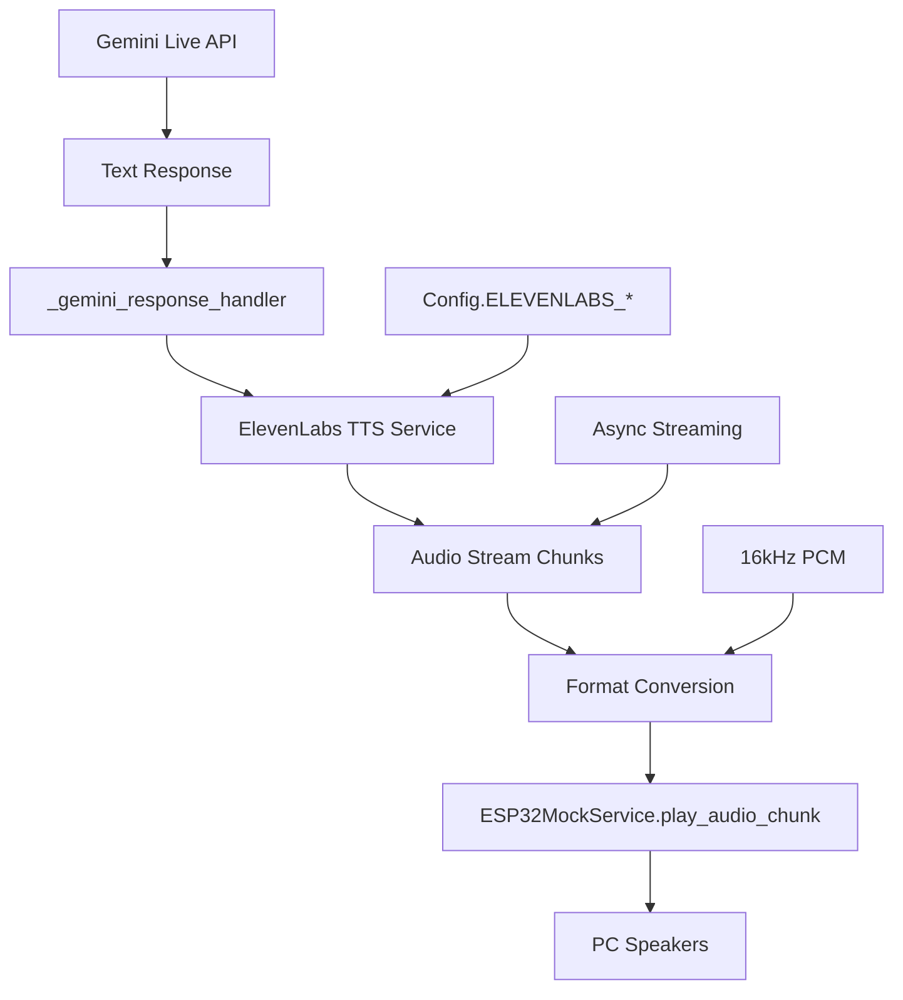

# ElevenLabs TTS Integration Implementation Plan

## Overview

Integrate ElevenLabs Text-to-Speech into the TARS project to convert Gemini Live API text responses into TARS voice audio, streamed directly to the ESP32 service for playback.

## Current State Analysis

### ✅ What We Have
- **Gemini Live API Integration**: Text responses are captured in [`_gemini_response_handler()`](../src/main.py:217-252)
- **ESP32 Audio Output**: [`ESP32MockService.play_audio_chunk()`](../src/services/esp32_mock_service.py:197) can queue and play audio
- **Audio Configuration**: 16kHz, 16-bit PCM, mono format defined in [`Config`](../src/config/settings.py:8-12)
- **ElevenLabs Config**: Voice ID and Model ID already added to [`settings.py`](../src/config/settings.py:43-44)

### ❌ What's Missing
- **ElevenLabs TTS Service**: No service class to handle TTS API calls
- **Audio Format Conversion**: ElevenLabs output → ESP32 compatible format
- **Integration Point**: No connection between Gemini text responses and TTS
- **Streaming Pipeline**: No immediate audio chunk streaming

## Implementation Architecture



## Component Implementation Plan

### 1. ElevenLabs TTS Service (`src/services/elevenlabs_service.py`)

**Responsibilities:**
- Async text-to-speech conversion using ElevenLabs API
- Audio format conversion to match ESP32 requirements
- Progressive chunk streaming (no buffering)
- Error handling and retry logic

**Key Methods:**
```python
class ElevenLabsService:
    async def initialize() -> None
    async def stream_tts(text: str) -> AsyncGenerator[bytes, None]
    async def shutdown() -> None
    def _convert_audio_format(chunk: bytes) -> bytes
```

**Audio Format Strategy:**
- Request PCM format from ElevenLabs at 16kHz to match [`Config.AUDIO_SAMPLE_RATE`](../src/config/settings.py:8)
- Convert to 16-bit mono if needed to match [`Config.AUDIO_DTYPE`](../src/config/settings.py:10) and [`Config.AUDIO_CHANNELS`](../src/config/settings.py:11)
- Stream chunks immediately without waiting for completion

### 2. Configuration Extension (`src/config/settings.py`)

Add ElevenLabs-specific settings:
```python
# ElevenLabs TTS Settings (extend existing)
ELEVENLABS_VOICE_ID = "qIT7IrVUa21IEiKE1lug"  # Already added
ELEVENLABS_MODEL_ID = "eleven_flash_v2_5"      # Already added
ELEVENLABS_OUTPUT_FORMAT = "pcm_16000"         # Match ESP32 format
ELEVENLABS_CHUNK_SIZE = 1024                   # Streaming chunk size
ELEVENLABS_STABILITY = 0.5                     # Voice stability (0-1)
ELEVENLABS_SIMILARITY_BOOST = 0.8              # Voice similarity (0-1)
```

### 3. Integration with TARSAssistant (`src/main.py`)

**Service Initialization:**
- Add ElevenLabs service to [`TARSAssistant.__init__()`](../src/main.py:38)
- Initialize service in [`_initialize_esp32_service()`](../src/main.py:88) or create separate init method

**Response Handler Modification:**
Modify [`_gemini_response_handler()`](../src/main.py:217-252) to:
1. Capture complete text when `response.is_turn_complete` is True
2. Send text to ElevenLabs TTS service
3. Stream audio chunks directly to ESP32 service

**Integration Points:**
```python
# In _gemini_response_handler()
if response.is_turn_complete:
    if full_response.strip():
        print()  # Keep existing console output
        
        # NEW: Stream TTS audio
        async for audio_chunk in self.elevenlabs_service.stream_tts(full_response):
            await self.esp32_service.play_audio_chunk(audio_chunk)
```

### 4. Service Registration (`src/services/__init__.py`)

Add ElevenLabs service to package exports:
```python
from .elevenlabs_service import ElevenLabsService

__all__ = [
    # ... existing services ...
    'ElevenLabsService'
]
```

## Implementation Sequence

### Phase 1: Core TTS Service
1. **Create ElevenLabs service class** with async streaming support
2. **Add audio format conversion** to match ESP32 requirements  
3. **Implement error handling** for API failures and network issues
4. **Add configuration management** for voice settings

### Phase 2: Integration
1. **Modify TARSAssistant** to initialize and manage ElevenLabs service
2. **Update response handler** to call TTS on complete responses
3. **Test audio pipeline** from Gemini text → ElevenLabs → ESP32 → speakers
4. **Add proper cleanup** in shutdown methods

### Phase 3: Testing & Polish
1. **Test end-to-end flow** with actual conversations
2. **Verify audio quality** and format compatibility
3. **Test error scenarios** (network failures, API errors)
4. **Performance optimization** for streaming latency

## Technical Implementation Details

### Audio Format Compatibility

**ElevenLabs API Configuration:**
```python
audio_stream = client.text_to_speech.stream(
    text=text,
    voice_id=Config.ELEVENLABS_VOICE_ID,
    model_id=Config.ELEVENLABS_MODEL_ID,
    output_format="pcm_16000",  # 16kHz PCM to match ESP32
    voice_settings=VoiceSettings(
        stability=Config.ELEVENLABS_STABILITY,
        similarity_boost=Config.ELEVENLABS_SIMILARITY_BOOST
    )
)
```

**Streaming Implementation:**
```python
async def stream_tts(self, text: str) -> AsyncGenerator[bytes, None]:
    """Stream TTS audio chunks without buffering."""
    audio_stream = await self.client.text_to_speech.stream(...)
    
    async for chunk in audio_stream:
        if isinstance(chunk, bytes):
            # Convert format if needed
            converted_chunk = self._convert_audio_format(chunk)
            yield converted_chunk
```

### Error Handling Strategy

1. **API Failures**: Retry with exponential backoff, fallback to text-only
2. **Network Issues**: Queue text for retry, continue with next responses  
3. **Audio Format Errors**: Log and skip malformed chunks
4. **Service Unavailable**: Graceful degradation to text-only mode

### Expected User Experience

**Current Flow:**
```
User: "Hey TARS, what's the weather?"
TARS: [Text only in console] "The weather today is sunny with a high of 72°F..."
```

**After Implementation:**
```
User: "Hey TARS, what's the weather?"
TARS: [TARS voice through speakers] "The weather today is sunny with a high of 72°F..."
      [Also still shows text in console for debugging]
```

## Dependencies

**Required Packages (already installed):**
- `elevenlabs` - ElevenLabs Python SDK
- `numpy` - Audio format conversion (already used by ESP32MockService)

**Environment Variables (already configured):**
- `ELEVENLABS_API_KEY` - Already set in `.env`

## Future Extensions (Out of Scope)

- **Interruption Support**: Allow user to interrupt TTS mid-speech
- **Voice Emotion Control**: Dynamic voice settings based on response content  
- **Multilingual Support**: Automatic language detection and voice switching (EN and CZ)
- **Audio Quality Optimization**: Adaptive bitrate and quality settings

## Testing Strategy

1. **Unit Tests**: ElevenLabs service with mocked API responses
2. **Integration Tests**: Complete flow from text → TTS → ESP32 playback
3. **Audio Quality Tests**: Verify format compatibility and audio clarity
4. **Error Scenario Tests**: Network failures, API errors, malformed audio

This implementation focuses solely on getting TTS working with immediate streaming, keeping interruption support for a future iteration to maintain task focus and complexity management.