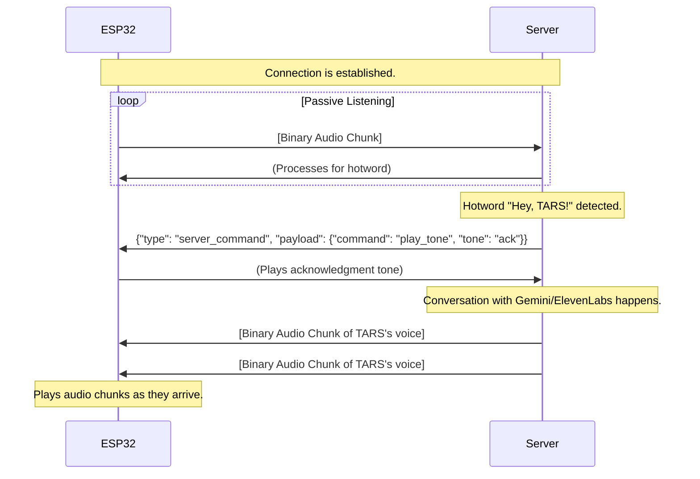

# Implementation Plan: Real ESP32 WebSocket Service

This document outlines the architecture and implementation details for the `ESP32Service`, which will handle real-time, bidirectional communication with the ESP32 hardware over WebSockets.

## 1. Overview

The `ESP32Service` will replace the existing `ESP32MockService` for production use. It will implement the `ESP32ServiceInterface` to ensure seamless integration with the existing application logic. Its primary responsibility is to manage a WebSocket server that the ESP32 device connects to, facilitating the streaming of audio data in both directions.
## 2. Key Design Decisions & Architecture

-   **Technology**: The service will be built using Python's `asyncio` for non-blocking I/O and the `websockets` library for a robust WebSocket server implementation.
-   **Endpoint**: It will expose a single WebSocket endpoint (e.g., `/ws`). The ESP32 will be the client connecting to this server.
-   **Communication Protocol**:
    -   **Client -> Server**: The ESP32 will stream raw PCM audio data (16-bit, 16kHz) as binary messages.
    -   **Server -> Client**: The server will stream synthesized PCM audio data back to the ESP32 as binary messages for playback.
    -   **Control Messages**: JSON-formatted text messages can be used for control signals in the future (e.g., status checks, commands), but the primary focus is on audio.
-   **Singleton Client**: The design assumes only one ESP32 client will be connected at any given time. The server will manage the connection state of this single client.
-   **Error Handling**: The service will gracefully handle client disconnections and reconnection attempts.

## 3. Configuration

It is recommended to add the following settings to `src/config/settings.py` to avoid hardcoding values:

```python
# src/config/settings.py

class Config:
    # ... existing settings
    
    # ESP32 Service Settings
    ESP32_SERVICE_TYPE = "real"  # "mock" or "real"
    ESP32_WEBSOCKET_HOST = "0.0.0.0"
    ESP32_WEBSOCKET_PORT = 8765
```

## 4. Communication Flow Diagram

```mermaid
sequenceDiagram
## 5. WebSocket Communication Protocol

To ensure clarity and robustness, the communication between the ESP32 and the backend server will follow a defined protocol. The `websockets` library transparently handles the low-level framing; this section defines the *payload* of those frames.

There are two types of messages: **Binary** for audio data and **Text (JSON)** for control messages.

### A. Binary Messages (Audio)

-   **Direction**: Bidirectional (ESP32 <-> Server)
-   **Content**: Raw PCM audio data (16-bit signed integers, 16,000 Hz, single channel).
-   **Usage**:
    -   **ESP32 to Server**: The ESP32 continuously sends chunks of microphone data as binary frames. The server receives these and forwards them to the audio processing pipeline (e.g., hotword detection).
    -   **Server to ESP32**: The server sends synthesized voice audio from ElevenLabs as binary frames. The ESP32 receives these and plays them directly on its speaker.

This is the high-throughput path, optimized for low-latency audio streaming. No metadata is included in these frames; the format is fixed and pre-agreed upon.

### B. Text Messages (JSON for Control & Status)

-   **Direction**: Bidirectional (ESP32 <-> Server)
-   **Content**: A UTF-8 encoded JSON string.
-   **Structure**: All JSON messages will have a `type` field to identify the message's purpose and a `payload` field containing the relevant data.

```json
{
  "type": "MESSAGE_TYPE_HERE",
  "payload": {
    "key": "value"
  }
}
```

#### **ESP32 -> Server Messages**

1.  **`client_status`**: Sent by the ESP32 to report its status.
    ```json
    {
      "type": "client_status",
      "payload": {
        "uptime_ms": 120000,
        "heap_free": 50123,
        "wifi_rssi": -55
      }
    }
    ```

2.  **`event`**: Sent when a physical event occurs on the device.
    ```json
    {
      "type": "event",
      "payload": {
        "source": "button",
        "action": "pressed"
      }
    }
    ```

#### **Server -> ESP32 Messages**

1.  **`server_command`**: Sent by the server to command the ESP32.
    ```json
    {
      "type": "server_command",
      "payload": {
        "command": "play_tone",
        "tone": "ack" 
      }
    }
    ```
    *Other commands could include `set_led_color`, `reboot`, etc.*

2.  **`server_status`**: Sent by the server to inform the client of its state.
    ```json
    {
      "type": "server_status",
      "payload": {
        "listening": true,
        "speaking": false
      }
    }
    ```

### Protocol Flow Example (Wake Word Activation)



This hybrid approach keeps the high-frequency audio data lean and fast (binary) while providing a flexible and extensible way to handle control and status information (JSON). The proposed code in the plan already handles the binary part; extending it to parse JSON is straightforward.
    participant ESP32
    participant Backend (ESP32Service)
    participant AppLogic

    ESP32->>+Backend (ESP32Service): Connect to ws://[host]:[port]/ws
    Backend (ESP32Service)->>-ESP32: Connection established

    AppLogic->>+Backend (ESP32Service): start_audio_streaming()
    Note over ESP32, Backend (ESP32Service): Server is now ready to receive audio
    Backend (ESP32Service)->>-AppLogic: Returns

    loop Audio Streaming
        ESP32->>Backend (ESP32Service): Sends binary audio chunk
        Backend (ESP32Service)->>AppLogic: Forwards audio via callback
    end

    AppLogic->>+Backend (ESP32Service): play_audio_chunk(audio_data)
    Backend (ESP32Service)->>+ESP32: Sends binary audio chunk for playback
    ESP32-->>-Backend (ESP32Service): (Plays audio)
    Backend (ESP32Service)-->>-AppLogic: Returns
```

## 5. Proposed Code for `src/services/esp32_service.py`

Below is the complete, production-ready code for the new service.

```python
"""
Real ESP32 Service Implementation using WebSockets.

This module provides a concrete implementation of the ESP32ServiceInterface,
handling real-time, bidirectional communication with an ESP32 device over
a WebSocket connection.
"""

import asyncio
import logging
from typing import Callable, Optional, Dict, Any
import websockets
from websockets.server import WebSocketServerProtocol, WebSocketServer

from src.services.esp32_interface import ESP32ServiceInterface, ESP32Status, AudioStreamConfig
from src.config.settings import Config

logger = logging.getLogger(__name__)

class ESP32Service(ESP32ServiceInterface):
    """
    Manages WebSocket communication with a single ESP32 client.
    
    This service runs a WebSocket server that the ESP32 connects to. It handles
    bidirectional audio streaming and manages the connection state.
    """

    def __init__(self, config: Config):
        self._config = config
        self._status = ESP32Status()
        self._audio_callback: Optional[Callable[[bytes], None]] = None
        self._client: Optional[WebSocketServerProtocol] = None
        self._server_task: Optional[asyncio.Task] = None
        self._server: Optional[WebSocketServer] = None
        self._playback_queue = asyncio.Queue()
        self._playback_task: Optional[asyncio.Task] = None

    async def initialize(self) -> None:
        """Starts the WebSocket server."""
        if self._server_task:
            logger.warning("Service already initialized.")
            return
        
        host = getattr(self._config, 'ESP32_WEBSOCKET_HOST', '0.0.0.0')
        port = getattr(self._config, 'ESP32_WEBSOCKET_PORT', 8765)
        
        self._server_task = asyncio.create_task(
            websockets.serve(self._connection_handler, host, port)
        )
        logger.info(f"ESP32 WebSocket server started on {host}:{port}")

    async def shutdown(self) -> None:
        """Stops the WebSocket server and cleans up resources."""
        if self._server:
            self._server.close()
            await self._server.wait_closed()
            logger.info("WebSocket server stopped.")
        if self._server_task:
            self._server_task.cancel()
            try:
                await self._server_task
            except asyncio.CancelledError:
                pass
            logger.info("Server task cancelled.")
        if self._playback_task:
            self._playback_task.cancel()
        logger.info("ESP32 service shut down.")

    async def _connection_handler(self, websocket: WebSocketServerProtocol, path: str):
        """Handles a new client connection."""
        if self._client and self._client.open:
            logger.warning("New client connected, but an existing client is active. Disconnecting new client.")
            await websocket.close(1013, "Service busy")
            return

        self._client = websocket
        self._status.is_connected = True
        logger.info(f"ESP32 client connected from {websocket.remote_address}")

        try:
            # Start the playback loop for this client
            self._playback_task = asyncio.create_task(self._playback_loop())
            # Handle incoming messages
            await self._message_loop()
        except websockets.exceptions.ConnectionClosed as e:
            logger.warning(f"Client connection closed: {e}")
        finally:
            self._client = None
            self._status.is_connected = False
            self._status.audio_streaming = False
            if self._playback_task and not self._playback_task.done():
                self._playback_task.cancel()
            logger.info("ESP32 client disconnected.")

    async def _message_loop(self):
        """Listens for incoming messages from the client."""
        async for message in self._client:
            if isinstance(message, bytes) and self._status.audio_streaming:
                if self._audio_callback:
                    self._audio_callback(message)
            elif isinstance(message, str):
                logger.info(f"Received text message from ESP32: {message}")


    async def _playback_loop(self):
        """Sends queued audio chunks to the client."""
        while self._status.is_connected:
            try:
                audio_data = await self._playback_queue.get()
                if self._client and self._client.open:
                    self._status.audio_playing = True
                    await self._client.send(audio_data)
                    self._playback_queue.task_done()
                self._status.audio_playing = self._playback_queue.qsize() > 0
            except asyncio.CancelledError:
                break
        logger.info("Playback loop stopped.")


    # --- Interface Implementation ---

    def set_audio_callback(self, callback: Callable[[bytes], None]) -> None:
        """Sets the callback for incoming audio data."""
        self._audio_callback = callback

    async def start_audio_streaming(self) -> None:
        """Enable forwarding of audio stream from ESP32."""
        self._status.audio_streaming = True
        logger.info("Audio streaming from ESP32 enabled.")

    async def stop_audio_streaming(self) -> None:
        """Disable forwarding of audio stream from ESP32."""
        self._status.audio_streaming = False
        logger.info("Audio streaming from ESP32 disabled.")

    async def play_audio_chunk(self, audio_data: bytes) -> None:
        """Queue an audio chunk to be sent to the ESP32 for playback."""
        if not self.is_connected():
            logger.warning("Cannot play audio, ESP32 not connected.")
            return
        await self._playback_queue.put(audio_data)

    async def stop_audio_playback(self) -> None:
        """Clear the playback queue."""
        while not self._playback_queue.empty():
            self._playback_queue.get_nowait()
            self._playback_queue.task_done()
        logger.info("Audio playback queue cleared.")

    async def wait_for_playback_completion(self) -> None:
        """Wait until all queued audio chunks have been played."""
        await self._playback_queue.join()
        logger.info("Audio playback completed.")

    async def capture_image(self) -> Optional[bytes]:
        """(Not Implemented) Capture image from camera."""
        logger.warning("capture_image is not implemented for the real ESP32 service yet.")
        return None

    def get_status(self) -> Dict[str, Any]:
        """Get current device status."""
        return self._status.__dict__

    def is_connected(self) -> bool:
        """Check if the ESP32 service is connected and operational."""
        return self._client is not None and self._client.open
