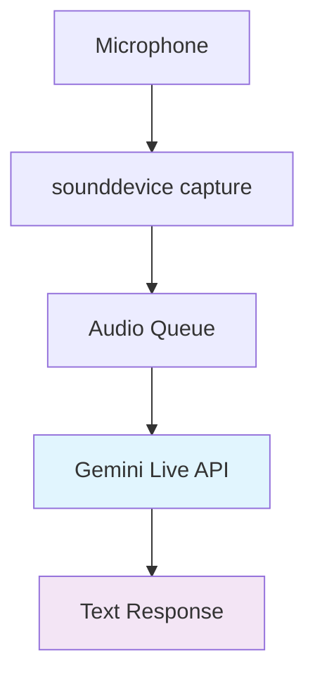
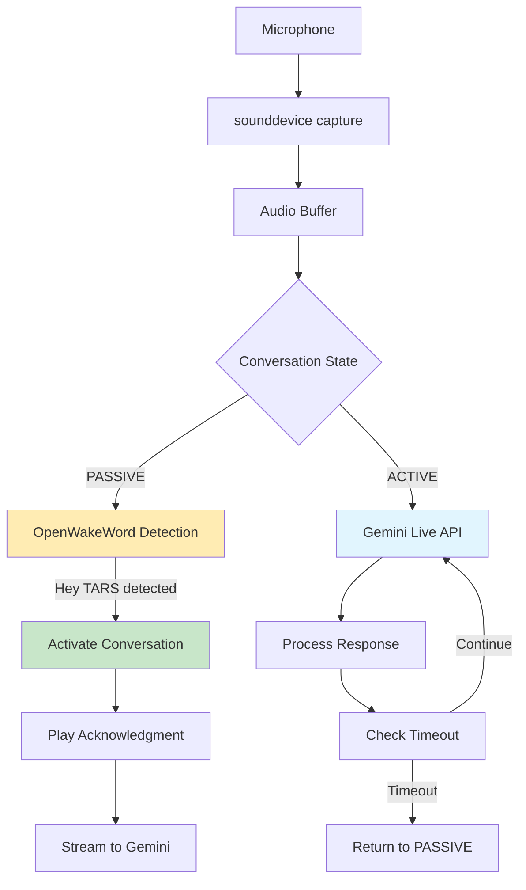
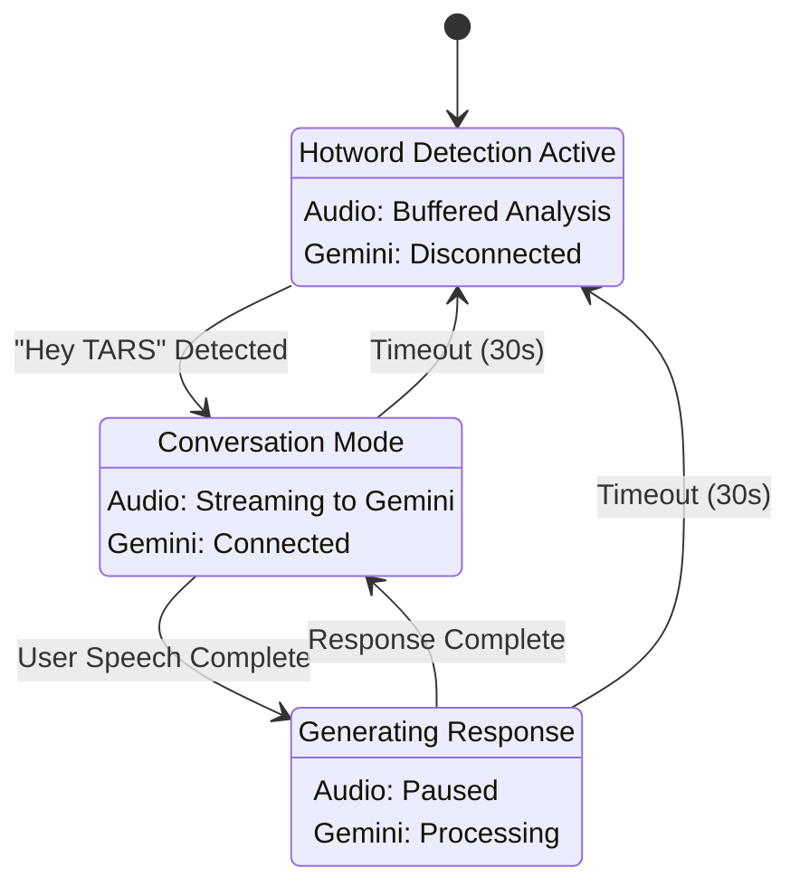

# Hotword Detection Implementation Plan for GemiTARS

## Overview

This plan integrates hotword detection using OpenWakeWord into the existing GemiTARS architecture, enabling the transition from "always-on conversation" to "hotword-activated conversation" mode as described in the README.

## Current vs Target Architecture

### Current Flow


### Target Flow with Hotword Detection


## State Machine Design

The hotword detection integrates with the existing [`ConversationState`](../src/core/conversation_state.py) system:



## Implementation Components

### 1. Technology Choice: OpenWakeWord

**Selected for:**
- Resource efficiency for continuous operation
- No API dependencies (completely local)
- Custom wake word support for "Hey TARS"
- Python native integration
- Active development and maintenance
- Free and open source

### 2. Core Components to Implement

#### A. Hotword Detection Service (`src/services/hotword_service.py`)
- OpenWakeWord integration for "Hey TARS" detection
- Audio buffer management and processing
- Configurable detection threshold
- Thread-safe activation callbacks
- Resource-efficient continuous monitoring

#### B. Enhanced Main Application (`src/main_with_hotword.py`)
- State-based audio routing (passive vs active modes)
- Hotword activation callback handling
- Conversation timeout management
- Seamless integration with existing GeminiService

#### C. Configuration Updates (`src/config/settings.py`)
- Hotword detection parameters
- Audio processing settings
- State transition timeouts

#### D. Dependencies (`requirements.txt`)
- OpenWakeWord and ONNX runtime
- Compatible with existing dependencies

### 3. Audio Pipeline Architecture

#### Passive Mode (Hotword Listening)
```
Microphone → sounddevice → Audio Buffer → OpenWakeWord → Detection Callback
```

#### Active Mode (Conversation)
```
Microphone → sounddevice → Audio Queue → Gemini Live API → Text Response
```

#### State Transition
```
PASSIVE --["Hey TARS" detected]--> ACTIVE --[timeout/completion]--> PASSIVE
```

## Implementation Steps

### Step 1: Install Dependencies and Setup [DONE]
1. Add OpenWakeWord to requirements.txt
2. Install necessary packages
3. Test OpenWakeWord basic functionality

### Step 2: Create Hotword Detection Service
1. Implement `HotwordService` class with OpenWakeWord
2. Add audio buffer management
3. Implement detection callback system
4. Add configurable threshold settings

### Step 3: Enhanced Main Application
1. Create `TARSAssistant` class for complete flow management
2. Implement state-based audio routing
3. Add hotword activation callback
4. Integrate conversation timeout handling

### Step 4: Configuration and Integration
1. Update configuration with hotword settings
2. Integrate with existing ConversationManager
3. Add proper error handling and cleanup

### Step 5: Testing and Validation
1. Test basic hotword detection
2. Verify state transitions
3. Test conversation flow (activation → conversation → timeout)
4. Validate resource usage and performance

## Expected Behavior Changes

### Before Implementation (Current)
- Microphone always feeds Gemini Live API
- No activation trigger - immediate conversation mode
- Manual conversation management

### After Implementation
- **Passive Mode**: Microphone feeds hotword detection, low resource usage
- **Activation**: "Hey TARS" triggers conversation mode with acknowledgment
- **Active Mode**: Audio streams to Gemini Live API for natural conversation
- **Timeout**: Automatic return to passive listening after inactivity

## Key Features

1. **Wake Word Detection**: "Hey TARS" activates conversation mode
2. **State Management**: Seamless transitions between passive and active states
3. **Resource Efficiency**: Minimal CPU usage during passive listening
4. **Conversation Timeouts**: Automatic return to standby after inactivity
5. **Acknowledgment System**: Audio/text feedback when activated
6. **Thread Safety**: Proper handling of audio callbacks and state changes

## File Structure After Implementation

```
src/
├── services/
│   ├── hotword_service.py          # NEW: OpenWakeWord integration
│   └── gemini_service.py           # EXISTING: Enhanced for state awareness
├── main_with_hotword.py            # NEW: Complete TARS assistant
├── config/
│   └── settings.py                 # UPDATED: Hotword configuration
└── core/
    └── conversation_state.py       # EXISTING: Used for state management
```

## Success Criteria

1. **Activation Response**: < 500ms from "Hey TARS" to acknowledgment
2. **False Positive Rate**: < 5% incorrect activations
3. **Resource Usage**: Minimal CPU impact during passive listening
4. **Conversation Flow**: Natural activation → conversation → timeout cycle
5. **State Consistency**: Reliable transitions between passive and active modes

This implementation transforms GemiTARS into a proper voice assistant that waits for activation while maintaining the existing conversation quality and Gemini Live API integration.