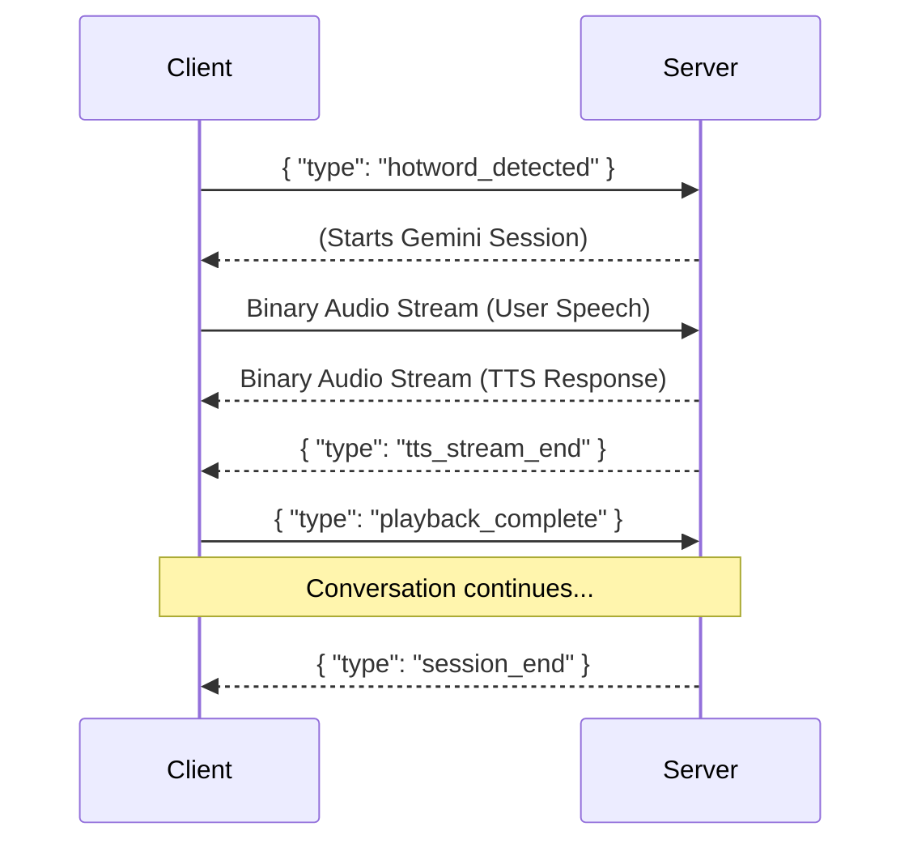
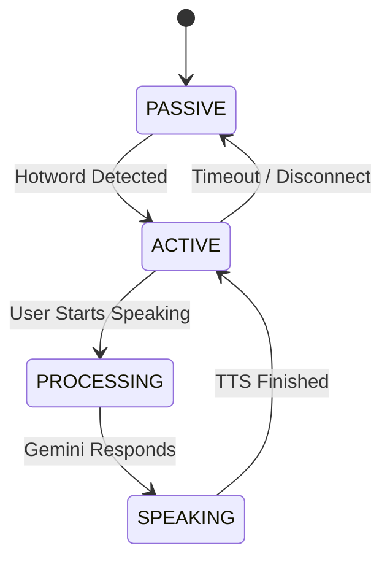
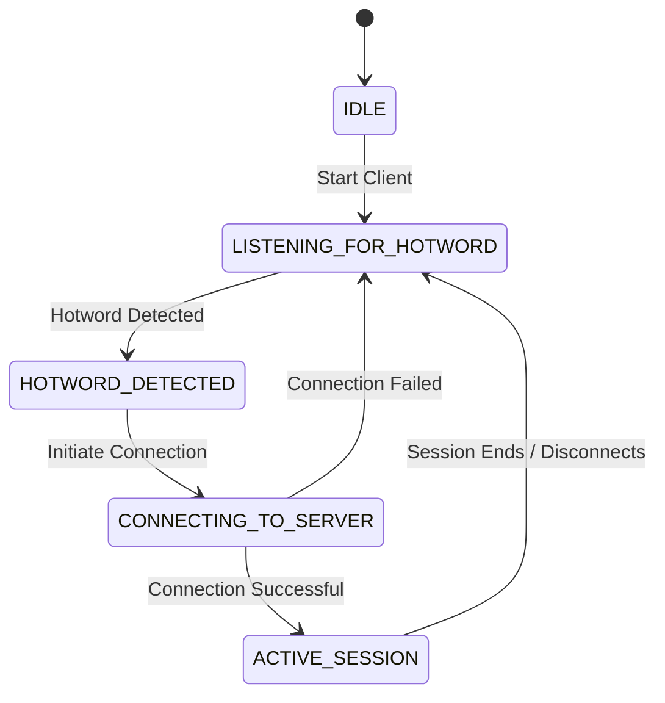
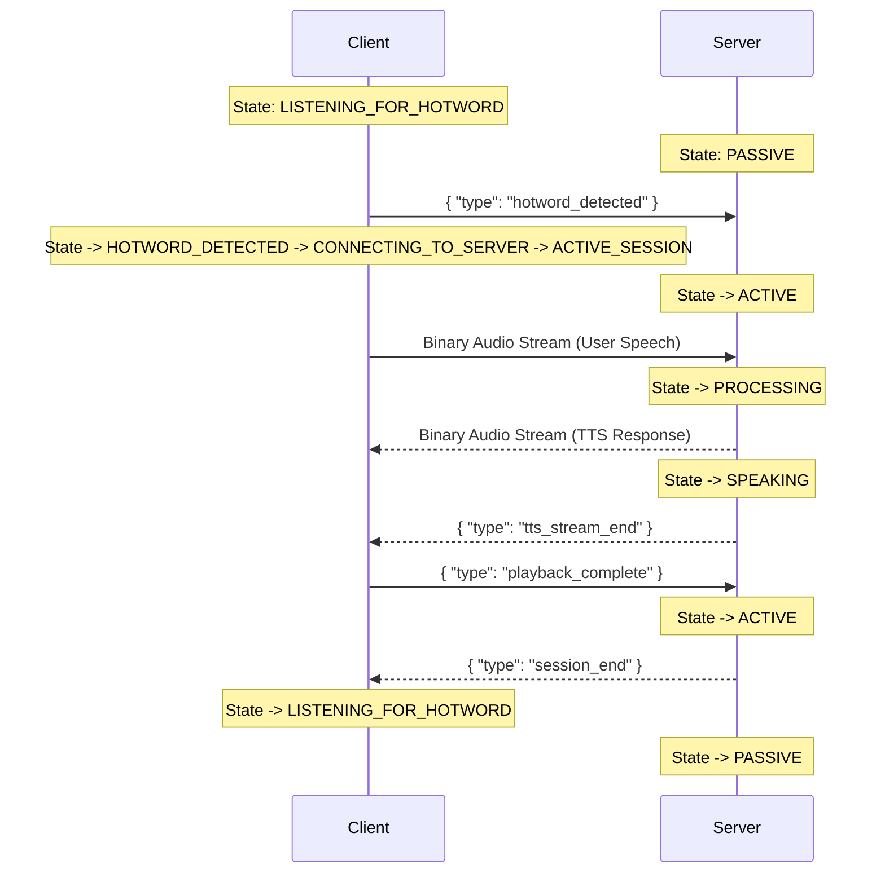

# TARS System Architecture

This document outlines the complete (CURRENT!) architecture of the TARS system, including the server and the Raspberry Pi client. It details the communication protocol, state management, and the interaction between the two components.

This document might be outdated.

## 1. WebSocket Communication Protocol

The client and server communicate over a WebSocket connection. The protocol consists of JSON control messages and binary audio data.

### Message Flow

The following diagram illustrates the typical message flow during a conversation:

## 2. Server-Side State Management

The server uses a state machine to manage the conversation flow. The state is managed by the `ConversationManager` class.

### Server States

- **PASSIVE**: The server is idle and waiting for a `hotword_detected` message from the client.
- **ACTIVE**: The server has received a hotword notification and is actively listening for user speech to stream to the Gemini API.
- **PROCESSING**: The server has received user speech and is waiting for a response from the Gemini API.
- **SPEAKING**: The server is streaming Text-to-Speech (TTS) audio to the client for playback.

### State Diagram

## 3. Pi Client-Side State Management

The Pi client also uses a state machine to manage its lifecycle, from listening for a hotword to participating in an active conversation.

### Client States

- **IDLE**: The initial state before the client starts.
- **LISTENING_FOR_HOTWORD**: The client is actively listening for the "Hey TARS" hotword.
- **HOTWORD_DETECTED**: The hotword has been detected, and the client is preparing to connect to the server.
- **CONNECTING_TO_SERVER**: The client is establishing a WebSocket connection with the server.
- **ACTIVE_SESSION**: The client is connected to the server and is in an active conversation session.

### State Diagram

## 4. State Machine Interaction

The client and server state machines are loosely coupled and interact primarily through the WebSocket message protocol. The following diagram illustrates how a state change on one side can trigger a state change on the other.

This concludes the initial draft of the TARS system architecture documentation. Please review it and let me know if you would like any changes or additions.
