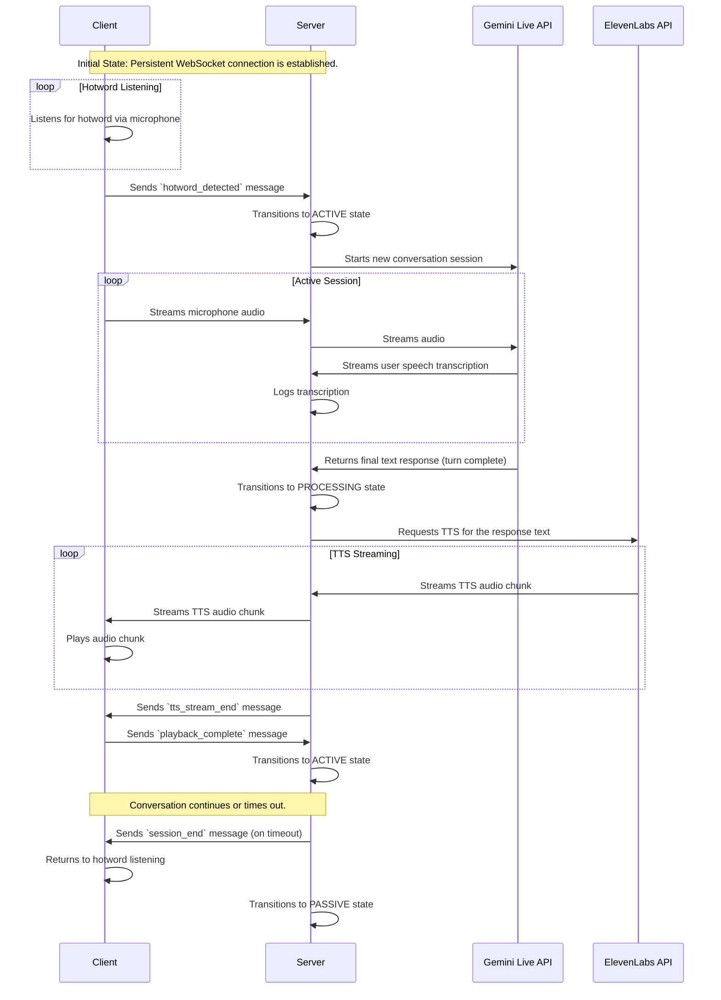

# System Architecture

This document outlines the current architecture of the GemiTARS system, which is composed of two main components: a **Pi Client** and a **Server**. The communication between them is handled via a persistent WebSocket connection.

## 1. High-Level Overview

The system is designed for real-time, voice-driven interaction.

- **Pi Client**: Runs on a Raspberry Pi (or a PC for development). It is responsible for hotword detection, audio input/output, and maintaining a persistent connection to the server.
- **Server**: Orchestrates the conversation by integrating with the Gemini Live API for language understanding and the ElevenLabs API for text-to-speech (TTS). It manages the conversation state and streams audio back to the client.

The core of the architecture is the **persistent WebSocket connection**, which eliminates connection latency and enables robust, real-time communication.

## 2. Pi Client Architecture

The client is an asynchronous application built using Python's `asyncio` library. It is responsible for capturing audio, detecting the hotword, and managing the user-facing interaction.

### 2.1. Core Components

- **`main.py`**: The main entry point of the application. It initializes all components and starts the `SessionManager`.
- **`PersistentWebSocketClient`**: Manages the WebSocket connection to the server. It automatically reconnects if the connection is lost and provides a simple interface for sending and receiving messages.
- **`SessionManager`**: Orchestrates the entire client-side workflow. It coordinates the other components based on the client's state.
- **`StateMachine`**: A simple state machine that defines the client's behavior (e.g., listening for hotword, active session).
- **`HotwordDetector`**: Uses `openwakeword` to listen for the "Hey TARS" hotword in the audio stream.
- **`PcAudioManager`**: Handles audio input (microphone) and output (speakers) using the `sounddevice` library.

### 2.2. Client-Side State Machine

The client's behavior is governed by a simple state machine with the following states:

- `IDLE`: The initial state before the application starts.
- `LISTENING_FOR_HOTWORD`: The client is actively listening for the hotword.
- `HOTWORD_DETECTED`: The hotword has been detected, and the client is preparing to start a session.
- `ACTIVE_SESSION`: The client is in an active conversation with the server, streaming microphone audio and playing back TTS audio.

### 2.3. Communication Flow

1.  **Initialization**: The `PersistentWebSocketClient` establishes a connection to the server and maintains it.
2.  **Hotword Detection**: The `SessionManager` starts the `HotwordDetector`, which processes audio from the `PcAudioManager`.
3.  **Session Start**: When the hotword is detected, the `SessionManager` transitions the state to `ACTIVE_SESSION` and notifies the server.
4.  **Audio Streaming**: The `SessionManager` streams microphone audio to the server via the `PersistentWebSocketClient`.
5.  **TTS Playback**: The `SessionManager` receives TTS audio from the server and plays it using the `PcAudioManager`.
6.  **Session End**: The session ends when the server sends a `session_end` message or the connection is lost. The client then returns to listening for the hotword.

## 3. Server Architecture

The server is the central hub of the system, responsible for processing audio, managing the conversation with the Gemini Live API, and generating TTS responses.

### 3.1. Core Components

- **`main.py`**: The main application entry point. It initializes and orchestrates all the server-side services.
- **`PiWebsocketService`**: A concrete implementation of the `PiInterfaceService` that handles WebSocket communication with a single client.
- **`GeminiService`**: Manages all interactions with the Gemini Live API, including session management, audio streaming, and response handling.
- **`ElevenLabsService`**: Handles text-to-speech conversion using the ElevenLabs API, streaming audio back to the client.
- **`ConversationManager`**: Manages the server-side conversation state, ensuring a logical flow from listening to speaking.

### 3.2. Server-Side State Machine

The server uses a state machine to manage the conversation flow:

- `PASSIVE`: The server is waiting for a `hotword_detected` message from the client.
- `ACTIVE`: The server is actively listening for user speech and streaming it to the Gemini Live API.
- `PROCESSING`: The server has received a complete user utterance and is waiting for the Gemini Live API to generate a response.
- `SPEAKING`: The server is streaming TTS audio to the client.

### 3.3. Communication Flow

1.  **Connection**: The `PiWebsocketService` listens for a client connection. Once a client connects, it is ready to receive messages.
2.  **Activation**: When the server receives a `hotword_detected` message, the `TARSAssistant` in `main.py` activates a new `GeminiService` session.
3.  **Audio Processing**: The server receives audio chunks from the client and forwards them to the `GeminiService`.
4.  **Response Generation**: The `GeminiService` processes the audio, generates a text response, and the `TARSAssistant` passes it to the `ElevenLabsService`.
5.  **TTS Streaming**: The `ElevenLabsService` converts the text to speech and streams the audio back to the client via the `PiWebsocketService`.
6.  **Session Management**: The `ConversationManager` tracks the conversation state and handles timeouts, returning the system to a passive state when the conversation is over.

## 4. WebSocket Communication Protocol

The client and server communicate over a persistent WebSocket connection. The protocol consists of binary messages for audio data and JSON messages for control signals.

### 4.1. Connection Management

- **Persistent Connection**: The client establishes a WebSocket connection on startup and maintains it for the entire application lifecycle.
- **Automatic Reconnection**: If the connection is lost, the client automatically attempts to reconnect with an exponential backoff strategy.
- **Heartbeat**: The client sends a ping frame to the server every 30 seconds to keep the connection alive and detect disconnections.

### 4.2. Message Types

- **Binary Messages**: Raw audio data is sent in binary frames.
  - Client to Server: Microphone audio chunks.
  - Server to Client: TTS audio chunks.
- **JSON Control Messages**: Control signals are sent as JSON objects with a `type` field.

#### 4.2.1. Client-to-Server Messages

- **`hotword_detected`**: Sent when the client detects the hotword.
  ```json
  {
    "type": "hotword_detected"
  }
  ```
- **`playback_complete`**: Sent after the client has finished playing all TTS audio chunks for a given response.
  ```json
  {
    "type": "playback_complete"
  }
  ```

#### 4.2.2. Server-to-Client Messages

- **`tts_stream_end`**: Sent after the server has finished streaming all TTS audio chunks for a response.
  ```json
  {
    "type": "tts_stream_end"
  }
  ```
- **`session_end`**: Sent when the server determines the conversation is over (e.g., due to a timeout).
  ```json
  {
    "type": "session_end"
  }
  ```

## 5. Conversation Flow Sequence Diagram

The following diagram illustrates the sequence of events during a typical conversation.


