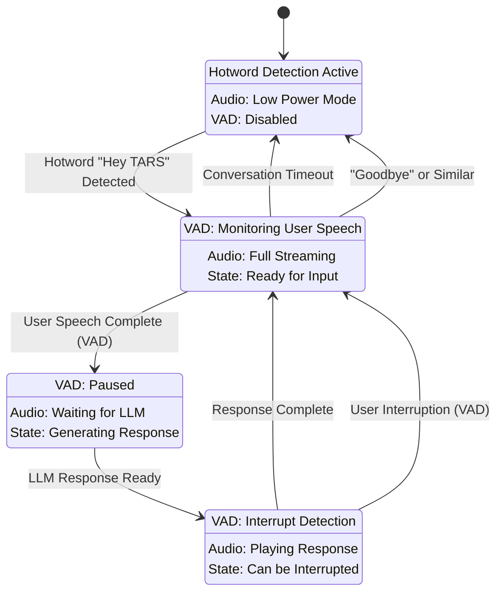

# VAD Implementation Plan for GemiTARS

## Overview

This plan integrates Voice Activity Detection (VAD) into GemiTARS to enable natural, human-like conversation flow with intelligent turn-taking, interruption handling, and automatic conversation state management.

## Current vs Enhanced Architecture

### Current Flow
```
Hotword → Audio Stream → Fixed Timeout → Response → Return to Hotword
```

### Enhanced Flow with VAD
```
Hotword → Active Conversation Mode → VAD-Driven Turn Management → Intelligent State Transitions
```

## State Machine Design



## Implementation Components

### 1. Enhanced State Manager

```python
# src/core/conversation_state.py
from enum import Enum
from typing import Optional, Callable
import asyncio
from datetime import datetime, timedelta

class ConversationState(Enum):
    PASSIVE_LISTENING = "passive"
    ACTIVE_CONVERSATION = "active" 
    PROCESSING = "processing"
    TARS_SPEAKING = "speaking"

class ConversationManager:
    def __init__(self):
        self.state = ConversationState.PASSIVE_LISTENING
        self.last_activity = datetime.now()
        self.conversation_timeout = 30  # seconds
        self.thinking_pause_threshold = 2  # seconds
        self.state_change_callbacks = {}
        
    async def transition_to(self, new_state: ConversationState):
        """Handle state transitions with proper cleanup"""
        old_state = self.state
        self.state = new_state
        self.last_activity = datetime.now()
        
        # Execute state-specific logic
        await self._execute_state_transition(old_state, new_state)
        
    def register_callback(self, state: ConversationState, callback: Callable):
        """Register callbacks for state changes"""
        self.state_change_callbacks[state] = callback
```

### 2. VAD-Enhanced Gemini Service

```python
# src/services/vad_gemini_service.py
from google.genai import types
from .gemini_service import GeminiService
from .conversation_state import ConversationManager, ConversationState

class VADGeminiService(GeminiService):
    def __init__(self, api_key: str, model: str = "gemini-live-2.5-flash-preview"):
        super().__init__(api_key, model)
        self.conversation_manager = ConversationManager()
        self.is_tars_speaking = False
        self.audio_playback_queue = asyncio.Queue()
        
        # Enhanced VAD configuration
        self.vad_config = {
            "response_modalities": ["TEXT"],
            "input_audio_transcription": {},
            "realtime_input_config": {
                "automatic_activity_detection": {
                    "disabled": False,
                    "start_of_speech_sensitivity": types.StartSensitivity.START_SENSITIVITY_MEDIUM,
                    "end_of_speech_sensitivity": types.EndSensitivity.END_SENSITIVITY_MEDIUM,
                    "prefix_padding_ms": 50,  # Capture slightly before speech
                    "silence_duration_ms": 1500,  # Natural pause detection
                }
            }
        }
        
    async def handle_conversation_flow(self):
        """Main conversation loop with VAD-driven state management"""
        while True:
            if self.conversation_manager.state == ConversationState.ACTIVE_CONVERSATION:
                await self._handle_active_conversation()
            elif self.conversation_manager.state == ConversationState.TARS_SPEAKING:
                await self._handle_tars_speaking()
            elif self.conversation_manager.state == ConversationState.PROCESSING:
                await self._handle_processing()
            
            await asyncio.sleep(0.1)  # Small sleep to prevent tight loop
            
    async def _handle_active_conversation(self):
        """Handle active conversation state with VAD"""
        async for response in self.receive_responses():
            # Check for user speech completion (VAD detected end of speech)
            if self._is_speech_complete(response):
                await self.conversation_manager.transition_to(ConversationState.PROCESSING)
                break
                
            # Check for conversation timeout
            if self._is_conversation_timeout():
                await self.conversation_manager.transition_to(ConversationState.PASSIVE_LISTENING)
                break
                
    async def _handle_tars_speaking(self):
        """Handle TARS speaking with interruption detection"""
        async for response in self.receive_responses():
            # Check for user interruption
            if response.server_content and response.server_content.interrupted:
                await self._handle_interruption()
                await self.conversation_manager.transition_to(ConversationState.ACTIVE_CONVERSATION)
                break
                
            # Check if TARS finished speaking
            if response.is_turn_complete:
                await self.conversation_manager.transition_to(ConversationState.ACTIVE_CONVERSATION)
                break
                
    def _is_speech_complete(self, response) -> bool:
        """Determine if user has finished speaking based on VAD"""
        if response.transcription_finished and response.transcription_text:
            # Additional logic for natural pause vs thinking pause
            silence_duration = self._get_silence_duration()
            
            # If it's a short pause, user might be thinking
            if silence_duration < self.conversation_manager.thinking_pause_threshold:
                return False
                
            # Longer pause likely means they're done
            return True
        return False
        
    async def _handle_interruption(self):
        """Handle when user interrupts TARS"""
        # Stop current audio playback
        await self._stop_audio_playback()
        
        # Clear any queued responses
        await self._clear_response_queue()
        
        print("TARS: [Interrupted] I'm listening...")
```

### 3. Audio Playback Manager

```python
# src/audio/playback_manager.py
import asyncio
from typing import Optional

class AudioPlaybackManager:
    def __init__(self):
        self.current_playback_task: Optional[asyncio.Task] = None
        self.playback_queue = asyncio.Queue()
        self.is_playing = False
        
    async def play_audio_stream(self, audio_data: bytes):
        """Play audio with interruption capability"""
        if self.current_playback_task:
            await self.stop_playback()
            
        self.current_playback_task = asyncio.create_task(
            self._play_audio_chunks(audio_data)
        )
        await self.current_playback_task
        
    async def stop_playback(self):
        """Immediately stop current audio playback"""
        if self.current_playback_task and not self.current_playback_task.done():
            self.current_playback_task.cancel()
            try:
                await self.current_playback_task
            except asyncio.CancelledError:
                pass
        
        self.is_playing = False
        
    async def _play_audio_chunks(self, audio_data: bytes):
        """Internal method to play audio in interruptible chunks"""
        self.is_playing = True
        # Implementation depends on your audio output system
        # This should play audio in small chunks that can be interrupted
```

### 4. Enhanced Main Application

```python
# src/main_vad.py
import asyncio
from services.vad_gemini_service import VADGeminiService
from core.conversation_state import ConversationState
from audio.playback_manager import AudioPlaybackManager
from hotword.detector import HotwordDetector  # Your existing hotword detection

class TARSAssistant:
    def __init__(self, api_key: str):
        self.gemini_service = VADGeminiService(api_key)
        self.audio_manager = AudioPlaybackManager()
        self.hotword_detector = HotwordDetector()
        
    async def run(self):
        """Main TARS assistant loop"""
        # Start concurrent tasks
        tasks = [
            asyncio.create_task(self._hotword_monitoring()),
            asyncio.create_task(self._conversation_management()),
            asyncio.create_task(self._audio_streaming()),
        ]
        
        await asyncio.gather(*tasks)
        
    async def _hotword_monitoring(self):
        """Monitor for hotword activation"""
        while True:
            if self.gemini_service.conversation_manager.state == ConversationState.PASSIVE_LISTENING:
                if await self.hotword_detector.detect("hey tars"):
                    print("TARS: Hello! How can I help you?")
                    await self.gemini_service.conversation_manager.transition_to(
                        ConversationState.ACTIVE_CONVERSATION
                    )
                    await self.gemini_service.start_session()
            
            await asyncio.sleep(0.1)
            
    async def _conversation_management(self):
        """Handle VAD-driven conversation flow"""
        await self.gemini_service.handle_conversation_flow()
        
    async def _audio_streaming(self):
        """Handle audio input streaming"""
        # Your existing audio streaming logic, but with state awareness
        while True:
            if self.gemini_service.conversation_manager.state in [
                ConversationState.ACTIVE_CONVERSATION, 
                ConversationState.TARS_SPEAKING
            ]:
                # Stream audio to Gemini
                audio_chunk = await self._get_audio_chunk()
                await self.gemini_service.send_audio(audio_chunk)
            
            await asyncio.sleep(0.01)  # Adjust based on your audio chunk rate
```

## Configuration Options

### VAD Sensitivity Profiles

```python
# src/config/vad_profiles.py
VAD_PROFILES = {
    "sensitive": {
        "start_of_speech_sensitivity": types.StartSensitivity.START_SENSITIVITY_HIGH,
        "end_of_speech_sensitivity": types.EndSensitivity.END_SENSITIVITY_HIGH,
        "silence_duration_ms": 800,  # Quick response
    },
    "normal": {
        "start_of_speech_sensitivity": types.StartSensitivity.START_SENSITIVITY_MEDIUM,
        "end_of_speech_sensitivity": types.EndSensitivity.END_SENSITIVITY_MEDIUM,
        "silence_duration_ms": 1500,  # Balanced
    },
    "patient": {
        "start_of_speech_sensitivity": types.StartSensitivity.START_SENSITIVITY_LOW,
        "end_of_speech_sensitivity": types.EndSensitivity.END_SENSITIVITY_LOW,
        "silence_duration_ms": 2500,  # Waits for thinking pauses
    }
}
```

## Implementation Steps

### Phase 1: Core VAD Integration (Week 1)
1. **Implement ConversationManager state machine**
2. **Enhance GeminiService with VAD configuration**
3. **Add basic interruption handling**
4. **Test state transitions**

### Phase 2: Audio Management (Week 2)
1. **Implement AudioPlaybackManager**
2. **Add interruption capabilities to audio playback**
3. **Integrate with existing audio streaming**
4. **Test interruption scenarios**

### Phase 3: Intelligent Turn-Taking (Week 3)
1. **Implement natural pause detection**
2. **Add conversation timeout logic**
3. **Fine-tune VAD sensitivity**
4. **Test various conversation patterns**

### Phase 4: Integration & Testing (Week 4)
1. **Integrate all components**
2. **Comprehensive testing**
3. **Performance optimization**
4. **Documentation and examples**

## Testing Scenarios

### 1. Natural Conversation Flow
- User: "Hey TARS, what's the weather?"
- TARS: "The weather today is..."
- User: [waits for complete response] "What about tomorrow?"
- TARS: "Tomorrow will be..."

### 2. Interruption Handling
- User: "Hey TARS, tell me about quantum physics"
- TARS: "Quantum physics is the study of..."
- User: [interrupts] "Wait, just give me a simple explanation"
- TARS: [stops immediately] "Of course! Simply put..."

### 3. Thinking Pauses
- User: "Hey TARS, umm... [2 second pause] ...what's 47 times 23?"
- System: [waits for user to complete thought, doesn't respond during pause]
- TARS: "47 times 23 equals 1,081"

## Success Metrics

1. **Response Latency**: < 500ms from end of user speech to TARS response start
2. **Interruption Response**: < 200ms to stop TARS when user speaks
3. **False Positives**: < 5% incorrect turn-taking decisions
4. **Conversation Flow**: Subjective evaluation of naturalness

This implementation will transform GemiTARS from a request-response system into a truly conversational AI assistant that feels natural and responsive to interact with.